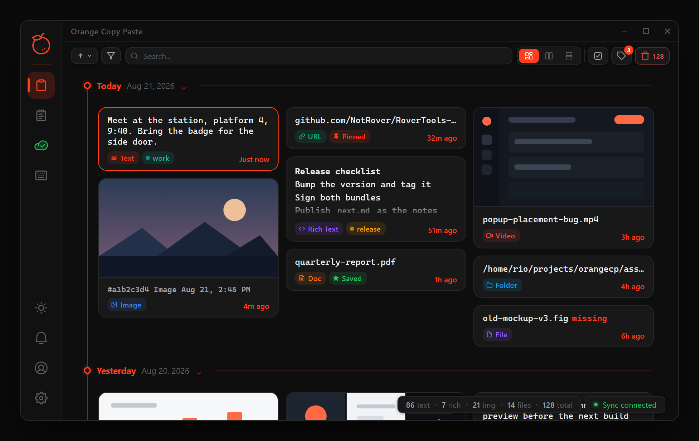
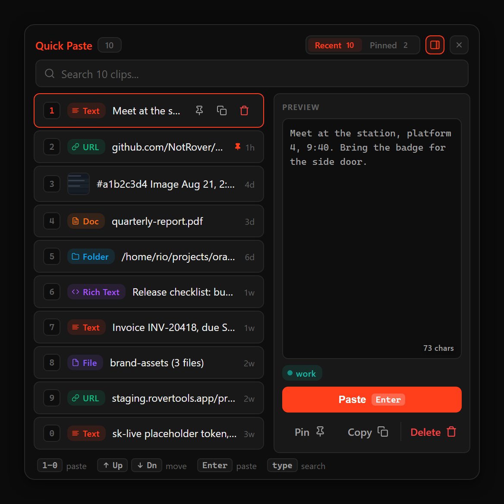
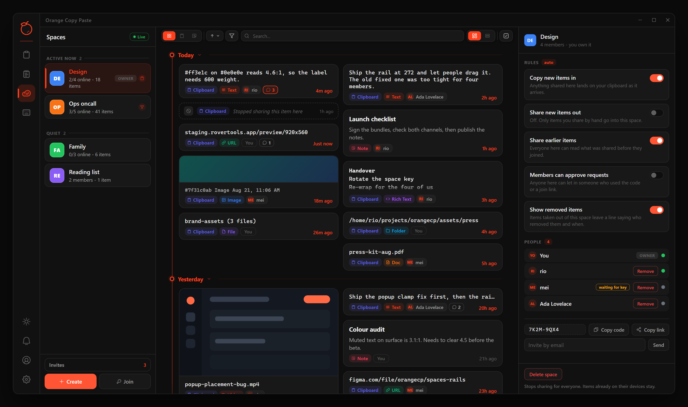
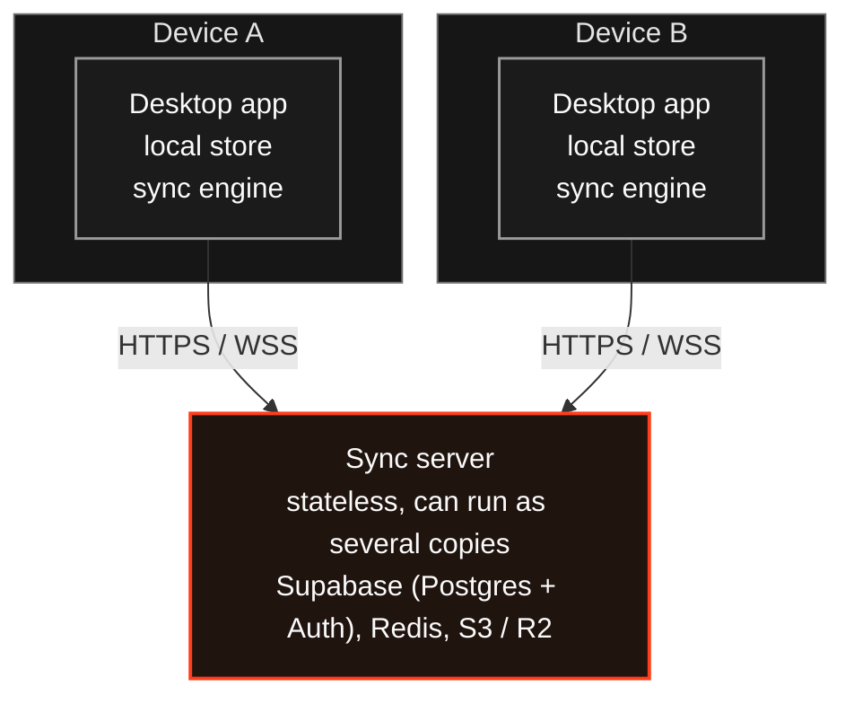

# Orange Copy Paste

A clipboard manager for Windows and Linux. It keeps a searchable history of what you copy, pastes any recent entry with <kbd>Ctrl</kbd>+<kbd>Shift</kbd>+<kbd>V</kbd> and a number key, and has notes next to your history. With an optional account, history and notes sync to your other computers and can be shared with other people in spaces. Everything that syncs is **end-to-end encrypted**: the server stores it and relays it, but cannot read it.



It works offline and without an account. Sync and spaces are the only parts that need one.

## Install

Download the latest build from the [releases page](https://github.com/NotRover/RoverTools-Orange-Copy-Paste-App/releases/latest):

- **Windows 10 or 11:** the file ending in `-setup.exe`. It installs for your user only, without admin rights.
- **Linux:** `.deb`, `.rpm` or AppImage. X11 works best; Wayland needs one setup step for the hotkeys, described in the [Linux notes](https://orange-copy-paste-app.pages.dev/docs/linux/).

The app updates itself from the same releases page. macOS is not supported yet.

Then follow [Install and first run](https://orange-copy-paste-app.pages.dev/docs/getting-started/): in about five minutes you copy three things, paste one by its number, and pin it. The full user guide is at [orange-copy-paste-app.pages.dev/docs](https://orange-copy-paste-app.pages.dev/docs/).

<p>
  
  
</p>

---

## What is in this workspace

This repository is the desktop app and the workspace for the whole product. The sync server and the website are submodules with their own repositories.

| Component | What it is | Stack |
| --- | --- | --- |
| [`orange-copy-paste-clipboard-app-rust/`](orange-copy-paste-clipboard-app-rust) | The desktop app: clipboard capture, history, notes, the sharing screens, and all encryption | React 19 and TypeScript with Vite, on Tauri 2 and Rust |
| [`orange-copy-paste-clipboard-backend/`](https://github.com/NotRover/RoverTools-Orange-Copy-Paste-Backend) | The sync server: encrypted storage, live updates between devices, sharing, file storage | Python 3.14 and FastAPI, Supabase Postgres and Auth, Redis, S3 or R2 |
| [`orange-copy-paste-clipboard-website/`](https://github.com/NotRover/RoverTools-Orange-Copy-Paste-Website) | The public site: the user guide, the developer docs, and the landing page | Astro and Starlight, Bun |

Each component has its own README with setup and development instructions.

## How the halves fit together



**The app is the source of truth for your data.** It captures the clipboard, stores history and notes on the computer, holds every key, and does all encryption and decryption. Rust owns the encryption and the sync engine; React is only the interface.

**The server is a relay and a store.** It checks the sign-in tokens Supabase issues (it never issues one itself), stores encrypted items, sends changes to other devices over a WebSocket, and hands out upload and download links for files. It defines the contract between app and server, and nothing else.

**Sync is optional.** With sync off or the server unreachable, the app works fully; changes queue on the computer and upload when it reconnects.

### Sync, in outline

1. The app signs in with Supabase Auth directly. Your password never leaves the computer: the app derives a separate login key from it, and a second key that stays behind.
2. The app fetches your encrypted master key from the server and opens it with the key that stayed behind.
3. It registers this computer as a device.
4. Items are encrypted on the computer, then pushed and pulled. When two edits collide, the newest wins.
5. A WebSocket brings live changes from your other devices and from your spaces.

Deletes travel as markers on the item, not as a delete request, so a delete reaches devices that were offline. **Sharing** has one building block, the **space**: live, any number of members, and a person can be in several. Each space has its own random key, locked separately for each member.

Exact routes, payloads, event names and key derivation are in the [server's architecture doc](https://github.com/NotRover/RoverTools-Orange-Copy-Paste-Backend/blob/main/docs/architecture.md), which owns the contract. What the server can and cannot see is in the [security model](https://orange-copy-paste-app.pages.dev/docs/security/).

---

## Repository layout

```text
RoverTools-Orange-Copy-Paste-App/
|- orange-copy-paste-clipboard-app-rust/   the desktop app (part of this repo)
|- orange-copy-paste-clipboard-backend/    submodule: RoverTools-Orange-Copy-Paste-Backend
|- orange-copy-paste-clipboard-website/    submodule: RoverTools-Orange-Copy-Paste-Website
|- docs/
|  |- architecture.md    the map: which doc owns which fact, and rules that bind app and server
|  |- permissions.md     who may do what, and where it is enforced
|  |- releasing.md       how a release is built, signed and published
|  |- writing-docs.md    how every doc and user-facing string is written
|  `- images/            README images, drawn from the website's app mockups
|- changelog/            release notes, one file per release
|- .github/workflows/    release.yml (publish a release), build-linux.yml (test Linux builds),
|                        redeploy-site.yml (rebuild the website when a mirrored doc changes)
|- .claude/skills/       Claude Code skills, for example cutting a release
`- CLAUDE.md             the workspace guide for AI coding agents
```

Clone with the submodules:

```bash
git clone --recurse-submodules https://github.com/NotRover/RoverTools-Orange-Copy-Paste-App.git
```

If you already cloned without them:

```bash
git submodule update --init --recursive
```

The default branch is `main` in all three repositories. Keep each commit to one repository.

## Quick start for developers

**Desktop app.** You need [Bun](https://bun.sh), a stable [Rust toolchain](https://rustup.rs), and the [Tauri prerequisites](https://v2.tauri.app/start/prerequisites/) for your system:

```bash
cd orange-copy-paste-clipboard-app-rust
bun install
bun run tauri dev
```

The app window opens with an empty history, and everything except sync works. To build with sync turned on, see [Point the app at your server](https://orange-copy-paste-app.pages.dev/docs/developers/self-hosting/#point-the-app-at-your-server).

**Sync server.** You need Python 3.14 or newer, [`uv`](https://docs.astral.sh/uv/), Docker, and a Supabase project. The steps, from `.env` to a health check, are in the [server README](https://github.com/NotRover/RoverTools-Orange-Copy-Paste-Backend#run-it-locally).

## Checks before you commit

Run the smallest set that covers what you changed:

| You changed | Run |
| --- | --- |
| The app's interface | `bun run build` |
| The app's Rust code | `cd src-tauri && cargo check` |
| Clipboard capture, hotkeys, popups, paste or sync | `bun run tauri dev`, then try that flow by hand |
| Server Python | `uv run ruff check src` and `uv run ty check src`, plus `uv run pytest` for logic changes |
| Any doc or text a user reads | The checklist in [`docs/writing-docs.md`](docs/writing-docs.md) |

Testing sync end to end needs a running server, a Supabase project and two accounts. If you could not test it, say so.

## Releasing

A release is one run of `.github/workflows/release.yml`. It publishes [`changelog/next.md`](changelog/) as the release notes, bumps the version, builds signed Windows and Linux bundles, and publishes them as a GitHub Release on this repository, where the in-app updater finds them. The inputs, the stable and beta channels, and signing-key setup are in [`docs/releasing.md`](docs/releasing.md). Releases never touch the sync server, which deploys on its own.

## Conventions

- **Commit messages:** a lowercase `type(scope): subject` line, then a few single-line bullets on what changed and why.
- **Release notes:** write `changelog/next.md` before releasing; an empty one stops the release. Internal changes go under `### Internal` and are never shown to users.
- **Pull requests** open as drafts against each repository's own `main`.
- **Migrations are written, never applied automatically.** Writing an Alembic migration is normal work; applying it to a real database is a separate, approved step.
- **Docs and user-facing text** follow [`docs/writing-docs.md`](docs/writing-docs.md) in all three repositories.

## Further reading

- [orange-copy-paste-app.pages.dev](https://orange-copy-paste-app.pages.dev): the user guide and the Developers section (architecture and security overviews, self-hosting, design records).
- [`docs/architecture.md`](docs/architecture.md): the map of which doc owns which fact. Start here to find the right doc.
- [App README](orange-copy-paste-clipboard-app-rust/README.md), [app architecture](orange-copy-paste-clipboard-app-rust/docs/architecture.md) and [bug-fix history](orange-copy-paste-clipboard-app-rust/docs/bugfix-history.md).
- [Server README](https://github.com/NotRover/RoverTools-Orange-Copy-Paste-Backend#readme), [server architecture](https://github.com/NotRover/RoverTools-Orange-Copy-Paste-Backend/blob/main/docs/architecture.md) and [deployment guide](https://github.com/NotRover/RoverTools-Orange-Copy-Paste-Backend/blob/main/docs/DEPLOY.md).
- [Website README](https://github.com/NotRover/RoverTools-Orange-Copy-Paste-Website#readme): how the site is built and deployed.

## Contributing and security

[CONTRIBUTING.md](CONTRIBUTING.md) covers setup, checks and pull requests. Report vulnerabilities as described in [SECURITY.md](SECURITY.md), never in a public issue. See also the [CODE_OF_CONDUCT.md](CODE_OF_CONDUCT.md). Licensed under the [GNU AGPL v3.0](LICENSE).

> Docs are context, not truth. Where a doc and the code disagree, the code wins, and the doc is worth fixing.
