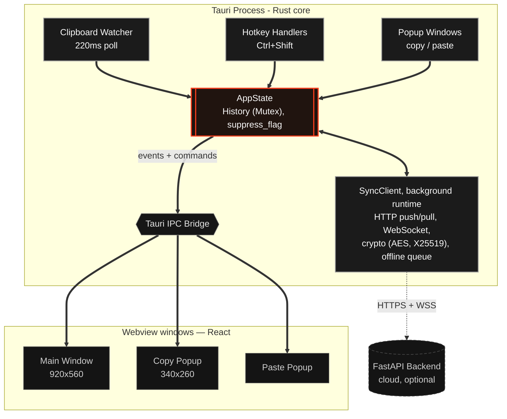
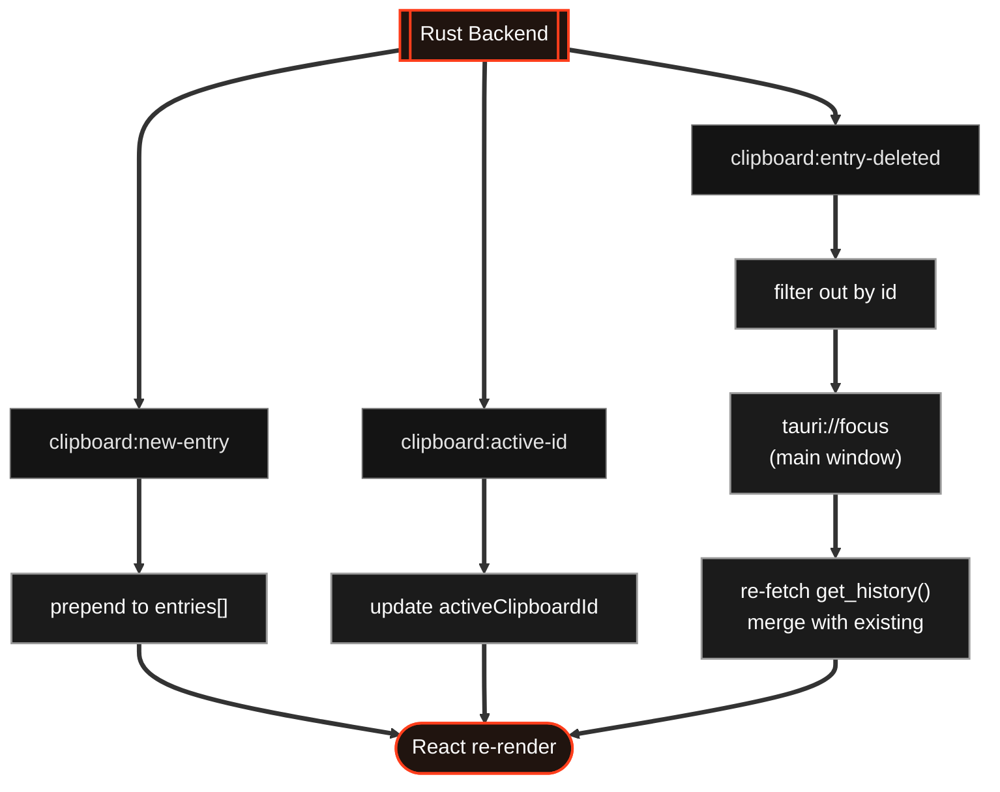
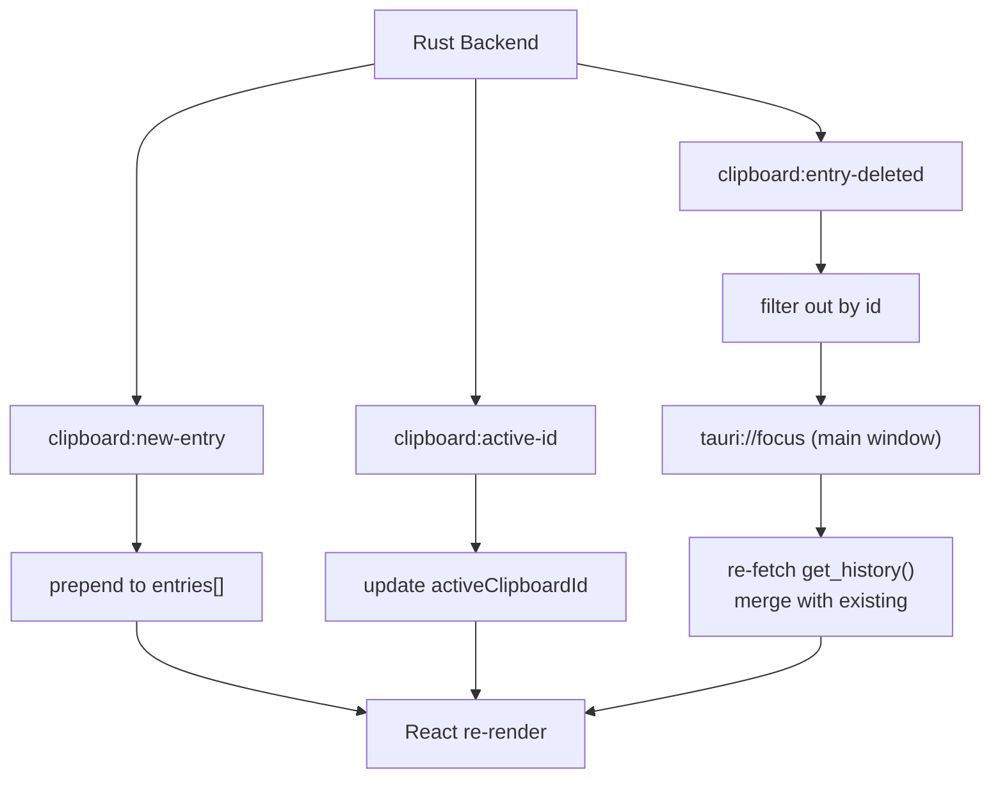

# Smart Clipboard — Architecture

A Tauri v2 + React desktop clipboard manager for **Windows and Linux** with real-time monitoring, global hotkeys, multi-window popups, and optional cloud sync with end-to-end encryption.

**Owns:** how this app works inside. Windows and runtime, app state, Tauri commands and
events, local persistence, the capture pipeline, and the client half of the sync engine —
what it does with what it receives.
**Not here:** the wire contract itself. Routes, payloads, DDL, socket-event shapes and the
crypto envelope live in `orange-copy-paste-clipboard-backend/docs/architecture.md`;
who-may-do-what in the root `docs/permissions.md`; cross-component invariants in the root
`docs/architecture.md`. Restating a payload here creates a second contract that nothing
keeps true.

---

## High-Level Overview



The app runs as a single Tauri process with three webview windows. The Rust backend owns all clipboard operations, history storage, and OS integrations. The React frontends communicate via Tauri commands (request/response) and events (push notifications). The `SyncClient` runs in a dedicated background Tokio runtime and is entirely optional — the app is fully functional without it.

---

## Tech Stack

### Backend

| Component                    | Version | Purpose                                                                        |
| ---------------------------- | ------- | ------------------------------------------------------------------------------ |
| Tauri                        | 2       | App framework, windowing, IPC                                                  |
| tauri-plugin-global-shortcut | 2       | Ctrl+Shift+C / Ctrl+Shift+V                                                    |
| tauri-plugin-autostart       | 2       | Launch on OS startup                                                           |
| arboard                      | 3       | Cross-platform clipboard (text + images); bypassed on Windows for image writes |
| windows-sys                  | 0.59    | Win32 APIs (clipboard formats, key simulation, monitors) — Windows only        |
| image                        | 0.25    | PNG encode/decode for clipboard images                                         |
| base64                       | 0.22    | Data-URL encoding                                                              |
| parking_lot                  | 0.12    | Mutex without poisoning                                                        |
| serde + serde_json           | 1       | Serialization for IPC and settings persistence                                 |
| rmp-serde                    | 1       | MessagePack binary serialization for history persistence                       |
| reqwest                      | 0.12    | Async HTTP client for sync push/pull (rustls TLS, JSON) — **sync module only**     |
| tokio-tungstenite            | 0.24    | Async WebSocket client for realtime events — **sync module only**                  |
| argon2                       | 0.5     | Argon2id key derivation for User Master Key (UMK) — **sync module only**           |
| aes-gcm                      | 0.10    | AES-256-GCM content encryption/decryption — **sync module only**                   |
| x25519-dalek                 | 2       | X25519 ECDH for multi-device key exchange and space key wrapping — **sync module only** |
| keyring                      | 2       | OS credential store for the device private key and cached Supabase session — **sync module only** |

> **Auth is delegated to Supabase.** The backend moved to **Supabase Auth (GoTrue) +
> Supabase Postgres**. The client performs sign-up / login / refresh / email
> verification / password reset against Supabase directly, then attaches the Supabase
> access token to backend calls. There is no backend-issued JWT and no
> `/auth/login` or `/auth/refresh` on our server. A Supabase auth client (GoTrue REST
> or an SDK) is required in the sync module.

### Frontend

| Component       | Version | Purpose                             |
| --------------- | ------- | ----------------------------------- |
| React           | 19.1    | UI framework                        |
| TypeScript      | 5.8     | Type safety                         |
| Vite            | 7       | Build tool (multi-page)             |
| @tauri-apps/api | 2       | IPC (commands + events)             |
| Vanilla CSS     | —       | Styling (CSS variables for theming) |

---

## Project Structure

```filetree
src-tauri/
├── src/
│   ├── main.rs                 # Process entry point
│   ├── lib.rs                  # App builder, setup, Tauri command registration
│   ├── health.rs               # Panic hook, heartbeat watchdog, atomic writes, quarantine
│   ├── updater.rs              # Signed self-update: check, download, install
│   ├── clock.rs                # One clock for the whole product: every timestamp is read here
│   ├── settings_file.rs        # settings.json reader (tolerates transient Windows sharing violations)
│   ├── clipboard/
│   │   ├── mod.rs              # Module re-exports
│   │   ├── commands.rs         # Tauri command handlers (get_history, copy, paste, etc.)
│   │   ├── history.rs          # ClipboardEntry, ClipboardHistory, binary persistence (image files + msgpack)
│   │   ├── files.rs            # CF_HDROP read/write (Windows file clipboard)
│   │   ├── html.rs             # CF_HTML read/write (rich text clipboard)
│   │   └── image.rs            # Multi-format image clipboard read/write
│   ├── notes/
│   │   ├── mod.rs              # Module re-exports
│   │   ├── commands.rs         # Tauri command handlers (get_notes, create/update/delete, groups)
│   │   └── store.rs            # Note model + MessagePack persistence
│   ├── notifications/          # Notification centre (bell popout)
│   │   ├── mod.rs              # Module re-exports
│   │   ├── commands.rs         # list/refresh/mark-read/dismiss; reconciles invites with the server
│   │   └── store.rs            # Notification model + MessagePack persistence, read TTL, cap
│   ├── sync/                   # Cloud sync module (optional, runtime-gated)
│   │   ├── mod.rs              # SyncClient init, background Tokio runtime
│   │   ├── client.rs           # reqwest HTTP client, Bearer + X-Device-Id injection, 401 refresh
│   │   ├── supabase.rs         # Supabase Auth (GoTrue): login, signup, refresh, recover, PKCE
│   │   ├── oauth.rs            # Google sign-in: loopback redirect server (ports 53170-53172)
│   │   ├── device_id.rs        # Stable per-machine device fingerprint (not identity)
│   │   ├── ws_listener.rs      # WebSocket connection, event dispatch to Tauri event system
│   │   ├── pending_queue.rs    # sync_pending.json read/write for offline accumulation
│   │   ├── id_map.rs           # client_id -> server_id map (id_map.json)
│   │   ├── sync_state.rs       # Connection/status state shared with the UI
│   │   ├── persist.rs          # Cached session + sync metadata persistence
│   │   ├── crypto.rs           # UMK unwrap (Argon2id KEK), AES-256-GCM, X25519 key exchange
│   │   ├── types.rs            # Wire types mirrored from the backend contract
│   │   ├── commands.rs         # Tauri commands: sync_login, sync_logout, sync_now, etc.
│   │   └── config.rs           # Server/Supabase endpoints + sync-enabled flag
│   ├── runtime/
│   │   ├── mod.rs              # Module re-exports
│   │   ├── clipboard_watcher.rs # Background polling thread (220ms)
│   │   ├── hotkeys.rs          # Global shortcut handlers (Ctrl+Shift+C/V)
│   │   ├── notifications.rs    # Copy/paste notification toast logic
│   │   ├── os_notify.rs        # OS desktop toast (Windows/Linux), distinct from the in-app popup
│   │   ├── popup_windows.rs    # Window creation, show/hide, focus handlers
│   │   ├── commands.rs         # Window control commands (close/resize popups)
│   │   ├── tray.rs             # System tray icon and menu
│   │   ├── platform/
│   │   │   ├── mod.rs           # cfg-gated module selection + cross-platform popup_position()
│   │   │   ├── windows.rs      # Win32: key simulation, cursor, monitors, DPI
│   │   │   └── linux.rs        # xdotool/wtype: key simulation, cursor, screen info
│   │   └── window_state.rs     # Saved window geometry (position, size)
│   └── state/
│       ├── mod.rs              # Re-exports
│       ├── app_state.rs        # AppState (shared history + flags)
│       └── popup_state.rs      # Popup dimensions, event payload structs
├── Cargo.toml
├── tauri.conf.json
└── capabilities/default.json

src/
├── types.ts                    # Shared types (ClipboardEntry, AppScreen, helpers)
├── hooks/                      # Shared React hooks (see "Shared Hooks" below)
├── components/
│   ├── app/
│   │   ├── index.html          # Main window HTML entry
│   │   ├── App.tsx             # Root component, state management, event listeners
│   │   ├── App.css
│   │   ├── sidebar/            # Navigation sidebar
│   │   ├── clipboard-screen/   # Main history view (tiles/list, day groups; progressive render)
│   │   │   ├── bulk-actions/   # Multi-select actions bar
│   │   │   ├── group-manager/  # Group CRUD card
│   │   │   ├── search-filter/  # Search + filters panel
│   │   │   └── entry-card/     # Entry cards (EntryCard, ChipBar, VideoPlayer)
│   │   ├── topbar/             # Sort/layout/filter/group controls (shared)
│   │   ├── view-toolbar/       # Toolbar above a single opened item (entry/space item/note)
│   │   ├── notes-screen/       # Notes UI (editor-engine, list, filters, groups)
│   │   ├── spaces-screen/      # Spaces: shared feed + space management/settings
│   │   ├── account-screen/     # Sync auth, cloud sync mode, devices/presence, storage
│   │   ├── settings-screen/    # User preferences + Cloud Sync controls
│   │   ├── shortcuts-screen/   # Keyboard shortcut reference
│   │   ├── card-menu/          # Right-click context menu (portal)
│   │   ├── notifications/      # Notification centre popout (bell)
│   │   ├── status-pill/        # Entry count summary bar
│   │   ├── update-banner/      # In-app update prompt (check/download/install)
│   │   ├── toast/              # Toast notifications (undo clear)
│   │   └── tooltip/            # Tooltip portal
│   ├── common/                 # Shared components (ConfirmDeleteDialog)
│   ├── entry-types/            # EntryTypePill (shared type badge)
│   ├── splash/                 # SplashScreen (startup)
│   ├── copy-popup/
│   │   ├── copy-popup.html     # Copy popup HTML entry
│   │   ├── CopyPopup.tsx       # Copy confirmation popup (preview, pin, delete)
│   │   └── copyPopup.css
│   ├── notifications/
│   │   ├── notification.html   # Copy/paste notification HTML entry
│   │   ├── Notification.tsx    # Notification component ("Copied"/"Pasted")
│   │   └── notification.css
│   └── paste-popup/
│       ├── paste-popup.html    # Paste popup HTML entry
│       ├── PastePopup.tsx      # Quick paste popup (keyboard slots, tabs)
│       └── pastePopup.css
```

---

## Rust Backend

### Entry Point & Setup

**`main.rs`** — Minimal entry: calls `lib::run()`.

**`lib.rs`** — Orchestrates the entire startup sequence:

1. **`kill_previous_instance()`** — Terminates any existing app process so global hotkeys are released. On Windows uses `tasklist`/`taskkill`; on Linux uses `pgrep`/`kill -9`. It waits first: see [Shutdown and the rotation window](#shutdown-and-the-rotation-window).
2. **`create_shared_history()`** — Creates `Arc<Mutex<ClipboardHistory>>`.
3. **`app_state_from_history()`** — Builds `AppState` from the shared history and suppress flag.
4. **`setup_runtime()`** — Called inside `tauri::Builder::setup`:
   - Configures the images directory (`{app_data}/images/`) for on-disk image storage
   - Loads history from `{app_data}/history.bin` (MessagePack binary) + `{app_data}/images/`
   - Loads pinned entries from `{app_data}/pinned_entries.bin` (fallback on first run)
   - Creates popup windows (hidden, off-screen)
   - Registers global shortcuts (Ctrl+Shift+C, Ctrl+Shift+V)
   - Starts clipboard watcher thread
   - Starts background flush thread (saves dirty history every 2s)
   - Sets up main-window focus handler (auto-hides popups)
   - Restores saved window geometry
   - Starts window move/resize tracking
   - Starts cloud sync, if it was enabled when the app last quit, through
     `sync::commands::get_or_create_client_with` — the same helper the commands
     use. Not a second construction: building a `SyncClient` is only half of
     starting sync, and the other half (the passive-pull and reminder loops)
     could never be repaired later, because every command that would have
     started them returns the client this path already installed.
5. Registers all Tauri command handlers.
6. Hooks `WindowEvent::Destroyed` on the main window to `exit(0)` the entire process.

#### Shutdown and the rotation window

GoTrue revokes a refresh token the instant it is presented. Between that request
and the keychain write, the account's only live credential exists nowhere but
memory, and a process that ends inside that window leaves the keychain holding a
token the server has already thrown away — which the next launch cannot tell
apart from a session that was genuinely revoked. So every way this process can
end has to know about that window.

`sync::client::RotationGuard` marks it. It is entered in the two places a token
is spent (`refresh_access_token`, and the restore path in `sync/mod.rs`, which
bypasses `refresh_lock` entirely), and it does two things: increments a
process-wide count, and writes a marker file naming this pid under the temp
directory.

| Exit path | What it does |
|---|---|
| Tray quit, window close, any `AppHandle::exit` | `RunEvent::ExitRequested` prevents the exit once, drains on a worker thread, then re-issues it. Two latches — one for "the drain is running", one for "this exit is ours" — because there are two independent sources of the event and the drain re-issues it; collapsing them gives either a skipped drain or an app that cannot be quit. |
| `health_restart_app` | Drains inline. A restart carries its own exit code and the runtime ignores an objection to it, so there is nothing to prevent — same reason the flush is inline here. Blocks the main thread for the budget. |
| `updater_install` | Flushes and drains **before** `install()`. On Windows the plugin ends this process from inside that call, so anything after it never runs. |
| Being force-killed by a relaunch | The victim gets no say, so the *killer* waits: `wait_out_rotation` polls the marker file and holds off while it names a process it is about to kill. A marker abandoned by a crash names a pid that is not a victim, so it costs one file read rather than the wait. |

`EXIT_DRAIN_MS` (3s) bounds all four. It is sized from the keychain write's own
retry ladder, so a rotation that is going to succeed is not cut off one step from
the end. A timeout is recorded in `crash.log` and never enforced: an app that
cannot be quit is a worse bug than a session that has to be signed into.

The window cannot be closed completely. It opens the moment GoTrue commits, which
is inside an await no exit hook can reach — if the process dies while the response
is in flight, the replacement token never existed locally. Only a write-ahead
marker closes that part, and it would change what the next launch may conclude
from a rejected token.

### State Management

```
AppState
├── history: Arc<Mutex<ClipboardHistory>>   ← shared across all threads
├── suppress_next_capture: Arc<AtomicBool>  ← prevents watcher re-capturing
├── keep_history: Arc<AtomicBool>           ← cached mirror of the setting (~1ns check)
├── history_dirty: Arc<AtomicBool>          ← triggers periodic flush to history.bin
├── close_to_tray: Arc<AtomicBool>          ← hide to tray instead of quitting
├── start_minimized: Arc<AtomicBool>        ← start hidden (minimized to tray)
├── notification_enabled: Arc<AtomicBool>   ← master toggle for copy/paste notifications
├── notif_copy: Arc<AtomicBool>             ← show notification on copy action
├── notif_paste: Arc<AtomicBool>            ← show notification on paste action
├── autosave: Arc<AtomicBool>               ← auto-add "Saved" group to new entries
├── active_clipboard_id: Arc<Mutex<String>> ← ID of the entry currently in the OS clipboard
├── notes: Arc<Mutex<NoteStore>>            ← shared notes store
├── notes_dirty: Arc<AtomicBool>            ← triggers periodic flush to notes.bin
├── notifications: Arc<Mutex<NotificationStore>> ← notification centre feed
├── notifications_dirty: Arc<AtomicBool>    ← triggers periodic flush to notifications.bin
└── sync_client: Option<Arc<SyncClient>>   ← None when sync disabled or not yet authed
```

**`AppState`** is managed by Tauri and injected into every command handler via `State<'_, AppState>`. The same `Arc` references are also held by the clipboard watcher thread and the hotkey handler closures.

**Suppress flag**: When `copy_entry`, `paste_entry`, or Ctrl+Shift+C write to the OS clipboard, they set `suppress_next_capture = true`. The next watcher poll sees this, clears it, and skips capture — preventing duplicate entries.

**Entry size** is capped as well as entry count. `MAX_TEXT_BYTES` (4 MiB) bounds one
text, rich-text or file-list entry; image content is a path to a file on disk and is
exempt. The cap exists because an entry is duplicated several times over on its way
to the user - into the store, into each webview that shows it, into MessagePack on
every flush, and into ciphertext when sync pushes it - so an unbounded entry is an
unbounded multiple. It is enforced at the three places an entry can enter memory:
`read_clipboard_capture` at capture (measuring the OS handle first on Windows, so an
oversized payload is never decoded into the process), `upsert_synced` on the sync
merge, and `drop_oversized` on load, which prunes a history file written before the
cap existed. A refused capture always shows the app's own toast, whatever the
notification preferences say, because the only other sign of it is the item's
absence.

`MAX_TEXT_BYTES` is deliberately well above what the server will store - see
`MAX_INLINE_SYNC_BYTES` in the sync section. What this app holds locally and what a
cloud row may weigh are different questions, and history is useful without sync; an
entry between the two is kept and marked local-only.

**History keeping**: When `keep_history` is enabled, the `history_dirty` flag is set on every mutation. A background thread flushes the full history to `history.bin` (MessagePack binary) every 2 seconds when dirty. Image data is externalised to individual files in the `images/` directory.

### Clipboard Module

#### `history.rs` — In-Memory History Store

```
ClipboardEntry {
    id: String            ← UUIDv4, generated at capture; doubles as the cross-device client_id
    kind: EntryKind       ← Text | Image | File | Html
    content: String       ← plain text / file path (images) / newline-delimited paths / html---PLAINTEXT---text
    timestamp: u64        ← Unix ms
    pinned: bool
    groups: Vec<String>   ← user-defined group tags (e.g. "Saved")
    label: Option<String> ← display name (e.g. "Image Mar 17, 2:45 PM" for images)
    content_hash: Option<u64> ← session-only dedupe hash; #[serde(skip)], not persisted
}
```

> **Sync note:** per-entry sync state is *not* stored on the entry. It lives in `id_map.json` and the pending queue, and the UI reads it via the `sync_get_entry_states` command (`useEntrySyncStates()`), gated by the `show_sync_badges` setting.

**`ClipboardHistory`** is a `Vec<ClipboardEntry>` with most-recent-first ordering:

| Method                              | Behavior                                                  |
| ----------------------------------- | --------------------------------------------------------- |
| `push(entry)`                       | Prepend, trim unpinned entries beyond `MAX_HISTORY` (100) |
| `push_if_distinct(entry)`           | Skip if top entry matches (kind + content)                |
| `push_if_distinct_with_flag(entry)` | Same, also returns whether insertion happened             |
| `top_matches(entry)`                | Whether the newest entry holds this content, taking no copy |
| `drop_oversized()`                  | Drop entries past `MAX_TEXT_BYTES`, returning their sizes  |
| `top(n)`                            | First N entries                                           |
| `find(id)` / `find_mut(id)`         | Lookup by ID                                              |
| `pin(id)` / `unpin(id)`             | Toggle pinned flag                                        |
| `remove(id)`                        | Delete by ID                                              |
| `clear()`                           | Remove all unpinned entries                               |
| `set_groups(id, groups)`            | Replace the groups list for an entry                      |
| `add_group(id, group)`              | Add a single group tag (no duplicates)                    |
| `purge_group(group)`                | Remove a group tag from every entry that has it           |
| `rename_group(old, new)`            | Rename a group tag across all entries                     |
| `remove_group(id, group)`           | Remove a single group tag from an entry                   |
| `pinned_entries()`                  | All pinned entries                                        |
| `saved_entries()`                   | All entries that survive restarts (pinned or saved)       |
| `all()`                             | Full history slice (most-recent first)                    |
| `set_images_dir(dir)`               | Configure the directory for on-disk image storage         |
| `load_saved_from_file(path)`        | Restore saved entries from MessagePack binary on startup  |
| `save_saved_to_file(path)`          | Save pinned/saved entries to MessagePack binary           |
| `save_all_to_file(path)`            | Flush full history to disk, clean orphaned image files    |
| `load_all_from_file(path)`          | Load full history from MessagePack binary                 |

#### `commands.rs` — Tauri Command Handlers

| Command                    | Signature                     | Description                                                                                          |
| -------------------------- | ----------------------------- | ---------------------------------------------------------------------------------------------------- |
| `get_history`              | `() → Vec<ClipboardEntry>`    | Return full history (most-recent first)                                                              |
| `delete_entry`             | `(id) → bool`                 | Remove entry, emit `clipboard:entry-deleted`                                                         |
| `clear_history`            | `() → bool`                   | Remove all unpinned entries                                                                          |
| `pin_entry`                | `(id) → bool`                 | Pin entry (max 10), auto-save to disk                                                                |
| `unpin_entry`              | `(id) → bool`                 | Unpin entry, auto-save to disk                                                                       |
| `copy_entry`               | `(id) → bool`                 | Write entry to OS clipboard, set suppress flag, update active clipboard ID, show copy notification   |
| `paste_entry`              | `(id) → bool`                 | Write to clipboard, hide popup, simulate Ctrl+V, update active clipboard ID, show paste notification |
| `save_history`             | `() → bool`                   | Flush full history to disk (on first enable)                                                         |
| `get_active_clipboard_id`  | `() → String`                 | Return ID of entry currently in the OS clipboard                                                     |
| `set_entry_groups`         | `(id, groups) → bool`         | Set group tags for an entry, auto-save                                                               |
| `purge_group_from_entries` | `(group) → bool`              | Remove a group tag from all entries                                                                  |
| `rename_group_in_entries`  | `(old_name, new_name) → bool` | Rename a group tag across all entries                                                                |
| `bulk_delete_entries`      | `(ids) → u32`                 | Delete multiple entries, returns count removed                                                       |
| `bulk_pin_entries`         | `(ids, pin) → u32`            | Pin/unpin multiple entries (respects MAX_PINNED)                                                     |
| `bulk_set_groups`          | `(ids, groups) → u32`         | Set same groups on multiple entries                                                                  |
| `bulk_add_group`           | `(ids, group) → u32`          | Add a group to multiple entries                                                                      |
| `bulk_remove_group`        | `(ids, group) → u32`          | Remove a group from multiple entries                                                                 |
| `get_setting`              | `(key) → Option<Value>`       | Read a setting from `settings.json`                                                                  |
| `set_setting`              | `(key, value) → bool`         | Write a setting; syncs in-memory caches for known keys (`sync_enabled`, `sync_server_url` included)  |
| `get_image_file_preview`   | `(path) → Option<String>`     | Read image file → data-URL (max 12 MB)                                                               |
| `get_video_file_preview`   | `(path) → Option<String>`     | Read video file → data-URL (max 36 MB)                                                               |
| `check_missing_files`      | `(paths) → Vec<String>`       | Returns paths that do not exist (used by paste popup before paste)                                   |

`get_image_file_preview` results are served from a bounded in-process **LRU cache**
(~32 MB, keyed by path + mtime + length) so repeated previews across the grid and the
copy/paste popups don't re-read the file — see `src-tauri/src/clipboard/commands.rs`.

#### `notes/commands.rs` — Notes Command Handlers

| Command                  | Signature                     | Description                     |
| ------------------------ | ----------------------------- | ------------------------------- |
| `get_notes`              | `() → Vec<Note>`              | Return all notes                |
| `create_note`            | `() → Note`                   | Create a new blank note         |
| `update_note`            | `(id, title, content) → bool` | Update note content/title       |
| `delete_note`            | `(id) → bool`                 | Delete a note by ID             |
| `pin_note`               | `(id) → bool`                 | Pin a note                      |
| `unpin_note`             | `(id) → bool`                 | Unpin a note                    |
| `set_note_groups`        | `(id, groups) → bool`         | Replace note groups             |
| `purge_group_from_notes` | `(group) → ()`                | Remove a group from all notes   |
| `rename_group_in_notes`  | `(old_name, new_name) → ()`   | Rename a group across all notes |
| `save_note_image`        | `(bytes, ext) → String`       | Save an image attachment; returns its stored path |
| `save_note_file`         | `(bytes, name) → String`      | Save a file attachment; returns its stored path |
| `get_note_attachments_dirs` | `() → NoteAttachmentDirs`  | Return the note image/file attachment directories |
| `export_note_text`       | `(text, filename) → String`   | Export a note's plain text to a file |

**Internal helpers:**

- `read_clipboard_entry()` — Reads current OS clipboard in priority order: files (CF_HDROP) → HTML (CF_HTML) → text → images (CF_PNG, registered formats, CF_DIB fallback). Returns `Option<ClipboardEntry>`.
- `write_entry_to_clipboard(entry)` — Writes a `ClipboardEntry` back to the OS clipboard. Text via arboard (with retry), files via CF_HDROP. **Images**: on Windows uses direct Win32 API (`write_image_to_clipboard`) bypassing arboard entirely; on Linux/other uses arboard RGBA fallback.
- `open_clipboard_with_retry()` — Opens an arboard `Clipboard` handle with up to 6 retries (50ms delay between each) to handle contention with the watcher thread or external apps.
- `set_active_clipboard_id(app, id)` — Updates the `active_clipboard_id` in `AppState` and emits the `clipboard:active-id` event to the frontend. Called from `copy_entry`, `paste_entry`, clipboard watcher, and copy shortcut handler.

#### `files.rs` — Windows File Clipboard (CF_HDROP)

Reads and writes file lists via `CF_HDROP` clipboard format using Win32 APIs:

- **Read**: `OpenClipboard` → `GetClipboardData(CF_HDROP)` → `DragQueryFileW` to extract paths.
- **Write**: Build `DROPFILES` struct + UTF-16 filename block → `GlobalAlloc` → `SetClipboardData(CF_HDROP)`.
- **Serialization**: File paths stored as newline-delimited strings in `ClipboardEntry.content`.

#### `html.rs` — Rich Text Clipboard (CF_HTML)

Reads and writes HTML content via the `CF_HTML` registered clipboard format:

- **Read**: Extracts the HTML fragment from the `CF_HTML` format header (StartFragment/EndFragment markers).
- **Write**: Constructs a `CF_HTML` header with proper byte offsets and writes the fragment via Win32 APIs.
- HTML entries store both the HTML fragment and a plain-text fallback separated by `\n---PLAINTEXT---\n`.

#### `image.rs` — Multi-Format Image Clipboard

**Reading** — tries formats in priority order:

1. **Registered custom formats**: `"PNG"`, `"image/png"`, `"image/jpeg"`, `"image/webp"`, `"image/bmp"`, `"JFIF"` — covers browsers, Snipping Tool, etc.
2. **CF_HDROP** — image file exposed as a shell file-drop.
3. **arboard fallback** — `CF_DIB`/`CF_DIBV5` for screenshots and classic Win32 apps.

Image data is initially encoded as `data:<mime>;base64,...` URLs. On push to history, images are externalised to individual files in the `images/` directory (named `{id}_{label}.{ext}`). The `content` field is replaced with the absolute file path. The frontend uses Tauri's `convertFileSrc()` asset protocol to display file-backed images.

**Writing (Windows)** — `write_image_to_clipboard(data_url)`:

Bypasses arboard entirely to avoid OS error 1418 caused by arboard's internal proxy-thread racing with the clipboard watcher. Uses direct Win32 API:

1. Decode base64 → image → RGBA pixels **before** opening the clipboard.
2. `OpenClipboard` with up to 10 retries (50ms delay).
3. `EmptyClipboard` → write **CF_DIB** (BITMAPINFOHEADER + BGRA bottom-up pixel data) + registered **"PNG"** format.
4. `CloseClipboard`.

**Writing (Linux/other)** — uses `data_url_to_rgba()` to decode the image, then writes via arboard's `set_image()` (which works reliably on non-Windows platforms).

### Notes Module

#### `store.rs` — Note Model and Storage

`NoteStore` keeps notes in-memory as `Vec<Note>` and persists them to `{app_data}/notes.bin` using MessagePack.

`Note` fields:

- `id`, `title`, `content` (sanitised HTML)
- `created_at`, `updated_at`
- `pinned`
- `groups`

Notes are sorted by `updated_at` descending, and a monotonic in-process counter is advanced on load to avoid ID collisions.

As with clipboard entries, per-note sync state is not a field on the note — it lives in `id_map.json`/the pending queue and is read via `sync_get_entry_states` (`useEntrySyncStates()`).

#### Persistence Behavior

- Note mutations set `notes_dirty = true`.
- The shared background flush thread writes `notes.bin` every ~2s when dirty.
- Notes are loaded during startup in `setup_runtime`.

---

### Notification Centre

One surface for everything the app has to tell the user, reached from the bell in
the sidebar bottom. It ships with space invites; `NotificationKind` is the seam
new sources arrive through (`space_activity`, `sync_warning`, `reminder`).

**The store records what the user was told, not the thing itself.** An invite
lives on the server and can be answered on another device, revoked, or expire
while this one is closed. So a `space_invite` notification carries the
`invite_id` in its opaque `data` map, and `notifications_refresh` re-reads
`GET /api/v1/invites` and retires any row that is no longer pending
(`resolved: "Joined" | "Declined" | "No longer available"` — the row stays as
history and drops its buttons). Signed out, refresh is a no-op rather than an
emptying: the feed is whatever the last sign-in left.

Ids are derived from the source (`invite:<invite_id>`), so ingesting the same
server row on every reconnect updates one record instead of stacking copies, and
`upsert` preserves the existing `read` flag and `created_at` — a refresh must
never push a row the user has already seen back to the top as if it were new.

| Command | Purpose |
|---------|---------|
| `notifications_list` | Whole feed, newest first |
| `notifications_unread_count` | Badge count |
| `notifications_refresh` | Reconcile against the server (async) |
| `notifications_mark_read` / `notifications_mark_all_read` | Read state |
| `notifications_dismiss` / `notifications_clear_read` | Removal |

Event `notifications:changed` (no payload) fires on every real change, so the
badge and an open popout re-read together. Read rows age out after 30 days and
the feed is capped at 500; unread rows are exempt from the age sweep. Signing in
as a different account clears the feed in `finalize_session` — invites are
addressed to a person.

**What raises a notification**

| Source | Kind | Where |
|--------|------|-------|
| An invite addressed to this user | `space_invite` | `notifications_refresh`, reconciled against `GET /api/v1/invites` |
| Someone joined or left a space, or a space was deleted | `space_activity` | `SyncClient::handle_membership_changed`, off the `space:membership_changed` socket event |
| An invite this user sent was accepted or declined | `space_activity` | `SyncClient::note_invite_answered`, off `invite:updated` |
| Somebody used a code or a join link on a space this user may approve | `space_invite` | `SyncClient::note_join_requested`, off `space:join_requested`. Raised only when `i_can_approve`, keyed on the request id so a replayed event cannot double-report. |
| A space became readable (its key arrived) | `space_activity` | `SyncClient::note_space_readable`, in `reconcile_spaces`. Gated on `SyncState::spaces_announced` - the keyring is memory-only, so the in-memory map cannot tell "just gained access" from "just launched". See bug #16. |
| A join request this user made was approved | `space_activity` | `SyncClient::note_join_approved`, off `space:join_decided`. A decline raises nothing loud - the row stops showing as pending. |
| A space owner removed something this user shared there | `space_activity` | `SyncClient::note_entry_taken_down`, in `drop_space_entry` |
| Sync refused to send an item | `sync_warning` | `record_skip` |
| Items sitting in the manual-mode queue | `reminder` | `remind_manual_queue_waiting`, on the reminder sweep |
| Blob storage past 90% | `reminder` | `remind_storage_nearly_full`, on the reminder sweep |
| The server said something | `announcement` (or whatever `kind` it names) | `SyncClient::pull_announcements` from `GET /api/v1/announcements`, and the `announcement:new` socket event |

Four rules the sources follow:

- **Your own actions are not news.** `note_membership_change` drops events whose
  actor is this user — you watched the screen change. Losing your *own*
  membership is the exception, and the reason the case exists: the payload
  cannot separate being removed from leaving, and missing a removal is worse
  than a redundant line after a deliberate leave.
- **Ids decide whether a row stacks or replaces.** A membership change is a
  distinct occurrence, so its id carries `now_ms()`. Everything else is keyed on
  the thing it is about (`invite-answered:<id>`, `space-removed:<space>:<type>:<client_id>`)
  so a replayed event cannot report it twice.
- **Bursts collapse to one row.** `record_skip` can fire hundreds of times in a
  single push, so it uses `raise_rolling` on the fixed id `sync-skipped`: one
  line carrying the count, back to unread whenever the count moves.
  `clear_skipped` dismisses it, or the centre would keep quoting a number the
  Account screen no longer shows.
- **Reminders describe a state, not an event,** so they are true on every sweep
  and would nag. `reminder_id` folds the current day into the id, which hands
  the rate limiting to the store's own idempotence: repeats inside a day land on
  the row that is already there (and `upsert` refreshes its count without
  re-alerting), while tomorrow gets a fresh row if the state still holds.

**Server-authored announcements** are the one notification the app does not
raise itself. They are also the one payload in the sync contract that arrives as
plaintext, and only because they are the *service's* words - a maintenance
window, a note to one account - never anything quoting content the server would
have had to decrypt to write.

Delivery is doubled, because the interesting case is a user who is not looking:
a connected socket gets `announcement:new` now, and `pull_announcements` hands
the same rows to a device that was closed. Both key on `announcement:<id>`, so
both landing is a no-op.

`SyncState::announcements_cursor` is what makes dismissing one stick. The server
keeps no per-user read state - it answers "what is newer than this" - so asking
for the same window twice would hand back rows the user had already cleared. The
cursor advances only *after* the rows are in the store, so a crash between the
two repeats a message rather than losing one.

Membership names come from the cached space list, which is stale until
`reconcile_spaces` has run — so `handle_membership_changed` owns the reconcile
and reads names on *both* sides of it: a joiner is not cached yet, and a space
that was left or deleted is gone afterwards. The fresher answer wins.

**Popout behaviour** (`components/app/notifications/NotificationsPopout.tsx`):

- Anchored to the bell in `sidebar-bottom` and portalled to `document.body`. It
  grows upward, so its top is computed after measuring rather than passed in.
- Rows render 15 at a time behind a "Show more" button; the count resets when
  the filter changes or the popout reopens.
- Filter chips only appear once more than one category is present.
- Unread rows are marked read on the *close* edge, not on click — so the list
  does not reflow under the cursor, and every route out (bell, click-outside,
  Escape, a parent closing it) counts exactly once.
- The outside-click handler ignores `[data-notif-bell]`, or the bell would close
  the popout and then immediately reopen it with its own click.
- A row carrying `space_id` in its `data` opens the Spaces screen on click or
  Enter. Invites awaiting an answer are excluded — answering must not be a side
  effect of trying to read the row. It lands on Spaces generally, not on the
  space itself; per-space deep linking would need a selection prop on
  `SpacesScreen`.

**Sound and the OS toast** are the same feed heard rather than read, so they hang
off `raise` instead of off each caller. `raise_cued` captures title, body and cue
*before* the store takes ownership of the row, then acts only if `upsert`
reported a real change — `notifications_refresh` re-reads the server's invites on
every panel open, and a sound per re-read would be unbearable.

- **A `Cue` is a family, not an event.** Six of them (`copy`, `paste`, `arrived`,
  `knock`, `unlocked`, `refused`) cover every source above, because the point is
  a set the user can learn: rising means something came, falling means something
  was refused, lower and slower means a person rather than a thing.
  `Cue::for_kind` maps a `NotificationKind` to one, and `raise_cued` lets a
  caller override where the kind is too broad — a space becoming readable and a
  join being approved are both `space_activity` and both want `unlocked`.
- **Rust decides when, the webview decides what it sounds like.** `notifications::cue`
  emits `ui:cue` with the name; `src/sounds.ts` synthesizes the tone in WebAudio
  and caches a buffer per cue. Nothing ships as an audio file and no audio
  backend is linked into the binary. The main window is the only listener, so a
  cue is heard once even though the popups are separate webviews — and it
  outlives every popup, since closing it either hides it or exits the app.
- **Copy and paste are cued at the two command call sites**
  (`clipboard::commands`), never inside `runtime::notifications::notify_if_enabled` —
  the clipboard watcher calls that same helper on every capture, so a cue there
  would fire on every copy anywhere in the OS. They are also the two cues that
  default to *off* (`sound_copy`, `sound_paste`), for the same reason.
- **The OS toast only fires while the app is not focused**
  (`runtime::os_notify`). A toast for something the user is looking at is the
  same sentence twice. A hidden window reports no focus, which is the answer we
  want, so the visible-and-focused test collapses into one check; an error from
  either question reads as "not focused", because a toast nobody needed costs
  less than dropping the only sign that something happened.

Settings, all device-local: `sound` (master), `sound_copy`, `sound_paste`,
`os_notifications`. There is deliberately no volume control - one level, chosen
to sit under whatever else is playing, beats a slider nobody moves twice. The
Settings screen previews the four cues the user cannot fire on demand
(`arrived`, `knock`, `unlocked`, `refused`) through `runtime::commands::play_cue`'s
frontend twin, `playCue(cue, true)`, which ignores the per-cue settings - you
have to be able to hear one to decide whether to turn it on. The frontend module holds them in memory and
the Settings screen calls `configureSounds` directly as well as writing them, so
a change takes effect on the next cue rather than the next launch.

---

### Cloud Sync Module

> **Status:** Implemented against the current Supabase-based backend contract,
> Rust module and React UI both.
> **Location:** `src-tauri/src/sync/` (UI in `src/components/app/account-screen/`
> and `spaces-screen/`)
>
> **Auth path as built:** identity comes from **Supabase Auth** (`sync/supabase.rs`
> — password login, signup, refresh, recovery, and PKCE for Google via
> `sync/oauth.rs`), not from a backend login route; the backend verifies the Supabase
> token and never issues one. The exact routes, headers, payloads and socket events
> are the wire contract: see
> `orange-copy-paste-clipboard-backend/docs/architecture.md`.

#### Google sign-in (two phases, and why)

The provider handshake does not use the `orange://` deep link. `sync/oauth.rs`
binds a loopback server on the first free port of `127.0.0.1:53170-53172`, uses
that bare origin as the PKCE `redirect_to`, opens the system browser, and reads
the `code` off the request line of the single request that comes back. Each of
those three ports has to be in the Supabase redirect allow-list.

Then it stops, because the session alone cannot decrypt anything - the account
password is the E2E secret and only the user has it:

1. `begin_oauth` finishes the handshake, probes `bootstrap` to learn whether the
   account already has an envelope (`is_new`), and stashes the session in
   `pending_oauth`. It returns `OAuthBegin` *and* emits `sync:oauth-ready`, since
   the command's reply is lost if the window was hidden or reloaded during the
   browser hop; `sync_oauth_pending` lets a freshly mounted UI pick the step back
   up.
2. `complete_oauth` takes the password, writes the envelope, and finalizes.

Three rules in phase 2, each of which was once broken - see bugs #9 and #10 in
`docs/bugfix-history.md`:

- The stash is **cloned**, not taken, and cleared only on success. A wrong
  password has to leave a retry possible, or the only way to guess again is
  another trip through the browser.
- For a new account the **envelope is written before** the Supabase credential.
  The other order can leave an account that signs in and cannot decrypt.
- `focus_main_window` runs the moment the loopback capture returns, on both the
  success and failure paths. The browser owns the foreground through the whole
  handshake, and whatever happens next is in the app.

The loopback serves a result page built from the same `App.css` tokens as the
sign-in screen, linking `orange://` as a manual way back.

#### Deep links

One scheme, `orange`, declared under `plugins.deep-link.desktop.schemes` in
`tauri.conf.json`. Two ingress routes, because a URL opened while the app is
already running arrives as argv rather than through the plugin: the plugin
callback in `setup`, and the single-instance handler, which also marks the launch
as a trigger so the running instance is not replaced.

`dispatch_deep_link` raises the window **first**, then parses. That order is what
makes a bare `orange://` a usable "come to the front" link, which is what the
OAuth result page uses. `parse_deep_link` then returns one of two shapes, keyed on
the host:

| URL | Event | Consumed by |
| --- | --- | --- |
| `orange://join?code=<CODE>` | `spaces:join-code` | `SpacesScreen`, which joins |
| `orange://reset?code=<CODE>` | `sync:password-reset` | `AccountScreen`, which sets the new password |

Anything other than `reset` that carries a code is a join, host ignored - so
`orange://anything?code=` still works. Kept deliberately: invite links already
sent out rely on it and cannot be re-sent.

Both events are held by `App`, not by the screen that uses them, because neither
screen is usually mounted when the link arrives. `App` stores the code and
switches screens; the screen reads it as a prop and calls back when it is done
with it.

#### Password reset, and change password

The password is only a wrapping key (see the backend's ARCHITECTURE section 7.1),
so a reset that mints a new one would leave everything already synced unreadable.
Both flows therefore re-wrap the **same** UMK.

The emailed link is PKCE, not the implicit flow: `recover()` sends
`redirect_to = reset_page_url` plus an S256 challenge, and the verifier goes
into the **OS keychain** - install-scoped, because a reset is requested while
signed out, and the two halves are usually separated by an app restart. The link
lands on a static page, which hands the code to `orange://reset?code=`. The
code alone is useless: redeeming it needs the verifier, which never left the
machine that asked.

`complete_password_reset` then recovers the UMK from the first source that has it:

| Source | Needs | When it applies |
| --- | --- | --- |
| In memory | already signed in | resetting from a running, signed-in app |
| Device wrap | this machine's keychain key | any machine that has signed in before |
| Recovery code | the code the user saved | the only source that works on a machine which has never signed in |
| Start over | nothing | last resort, and loses access to everything synced under the old key |

A supplied recovery code is tried first and its failure is returned rather than
falling through, so a typo reads as a typo instead of "this device has never held
your key".

**Finishing a reset takes more than one attempt, by design.** The recovery field
and the start-over button only appear once the plain attempt has failed and said
why, so the second attempt is the normal case rather than the exception. The
emailed code cannot be exchanged twice, so the session from the first exchange is
held in `SyncClient::pending_reset` and reused - dropped on success, and by
`sync_cancel_password_reset` when the panel closes, because it is a live
credential for the account. The device id is set on the reset's HTTP client
before the wrap is fetched; without it the device-wrap source silently cannot
apply (bug #15 in `docs/bugfix-history.md`).

#### Recovery code

A second account-wide envelope holding the same UMK, wrapped under a secret the
user keeps rather than one they remember. 30 characters in six groups of five -
150 bits - from a 32-symbol alphabet with `O`, `0`, `I` and `1` removed. Exactly 32
symbols so each character is 5 unbiased bits from one random byte.

`derive_kek` and the account's own `kdf_salt` are reused; only the secret and the
AAD differ (`umk-recovery-v1` against `umk-envelope-v1`). Sharing the salt is
deliberate, and the distinct AAD is what makes feeding one envelope to the other's
unwrap fail loudly rather than half-work - there is a test for exactly that.

The code is generated in Rust and returned once. It is not stored anywhere: only
its envelope goes to the server, and the envelope is uploaded **before** the code
is handed to the UI, so a code the user saves always opens something. Regenerating
replaces the envelope, which is what revokes the previous code - one is live at a
time.

Forced at the next sign-in when `bootstrap` reports `recovery_wrapped_umk: null`,
which is true of every account predating this. The panel blocks **only the account
screen**; clipboard, notes and capture keep working, because a modal that stops the
product is a worse failure than an unsaved code. Continue needs the "I saved my
recovery code" box ticked, and "Save as file" reuses `export_note_text`, which
writes to Downloads.

Starting over with a new key **clears** the envelope
(`DELETE /auth/umk/recovery`): it holds the key being abandoned, and left in place
it would hand a later recovery a key that decrypts nothing. Clearing it is also
what makes the panel ask for a fresh code.

Two ordering rules, both learned the hard way in the OAuth flow:

- The **envelope goes up before the password changes**. The other order can leave
  an account whose password opens nothing.
- The reset **ends by signing in normally** with the new password, so device
  registration, key registration and the device wrap all run through the single
  path that owns them.

`change_password` is the same thing minus the code exchange, for a user who is
already signed in - nothing has to be recovered, so nothing can be lost. It is
what the account screen offers, and why the reset link is the fallback rather than
the route.

**Requires a dashboard entry:** `reset_page_url` must be in Supabase
Authentication -> URL Configuration -> Redirect URLs, character for character.
Without it GoTrue ignores the redirect and falls back to the Site URL, which is
how this used to mail a localhost link, and how it broke again when the backend
changed hostname.

An older release sends its own compiled-in value, and no later release can change
that, so every value ever shipped has to stay listed until those installs have
aged out. Releases up to 0.2.2 send `{server_url}/reset`, which the backend now
answers with a 302 to the static page.

#### Overview

The sync module runs entirely in a dedicated background Tokio runtime (separate from Tauri's internal runtime) so it can never block clipboard capture or the UI.



#### `mod.rs` — SyncClient

`SyncClient` is the public handle held in `AppState`. It exposes:

- `on_new_entry(entry)` — called after every successful history push
- `on_delete_entry(id)` — called from `delete_entry` command
- `on_update_entry(entry)` — called from pin/group mutation commands
- `flush_pending()` — manually trigger offline queue flush
- `connect_ws()` / `disconnect_ws()` — WebSocket lifecycle

On startup (when sync is enabled and a Supabase session can be restored):

1. Restore the Supabase session (the Supabase client manages token refresh). On first
   login: `POST /auth/bootstrap` (fetch `kdf_salt`, derive UMK) and `POST /auth/devices`
   (obtain `device_id`)

**`sync_restore_session` does not wait for the restore.** It answers whether a session
is *coming back*, from local state only, and then hands the attempt to
`SyncClient::spawn_session_restore`; the outcome arrives on `sync:session-restored` or
`sync:restore-gave-up`. The command therefore returns in milliseconds, and
`RestoreOutcome.restoring` is true from the first instant rather than only after a
transient failure. The UI has nothing else to go on: while it awaited this command it
drew a sign-in form over a live session, and users signed in again — see bug #17 in
[bugfix-history.md](docs/bugfix-history.md). Three local questions decide the answer, none of
them touching the network:

| Question | Source | Answer |
|---|---|---|
| Is a client already built for this launch? | `AppState.sync_client` | Yes → use it, and do not re-read `settings.json`. |
| Did the user turn sync off? | `SyncConfig::enabled` **and** `enabled_known` | Off only counts when the file actually said so; a `settings.json` that would not open is not a sign-out. |
| Is there anything to restore? | `SyncClient::has_stored_session` | Keychain refresh token plus a user id from `sync_state.json` or the install session pointer. A store that will not answer counts as yes. |
2. Pull delta: `GET /sync/pull?after_ts={last_cursor}` (paginated), with `X-Device-Id`
3. Decrypt and merge remote entries into local store
4. Flush `sync_pending.json`
5. Open WebSocket connection (`/ws?token=<supabase jwt>&device_id=…`)

#### `client.rs` — HTTP Client

- Wraps `reqwest::Client` with base URL, the `Authorization: Bearer <supabase access token>` header, and the `X-Device-Id` header on device-scoped calls
- Token refresh is owned by the Supabase auth client; on 401 the client refreshes the Supabase session and retries the original request transparently
- All requests have a 10s timeout
- Connection errors → logged, backed off (1s → 2s → 4s → max 60s exponential)

#### `ws_listener.rs` — WebSocket Listener

Maintains a persistent `tokio-tungstenite` WebSocket connection to `wss://{server}/ws?token=<supabase access token>&device_id=<device_id>`.

On each received message, dispatches to:

| Event                              | Action                                                                                                                                                        |
| ---------------------------------- | ------------------------------------------------------------------------------------------------------------------------------------------------------------- |
| `sync:entry`                       | Unwrap the CEK (`personal` under UMK, else a carried space id through that space's keyring) → decrypt → insert or update in history/notes → emit `clipboard:new-entry` or `notes:updated`. Personal entries are skipped in passive mode; space entries always apply, and may auto-copy. Deletes arrive as tombstones on this event. |
| `device:online` / `device:offline` | Update sync status indicator via Tauri event                                                                                                                  |
| `space:membership_changed`         | Refresh spaces, emit `space:membership-changed`; an owner whose members lost their keys mints a new space key and redistributes                                |
| `space:rekey`                      | Reconcile: adopt the ring the server holds for us (checked against `key_fingerprint`), prepend a newly minted key if we own the space and one is owed, and wrap for any member who lacks one |
| `ping`                             | Respond with `pong`; this refreshes the device's presence TTL server-side                                                                                     |

Connection drop → automatic reconnect after 5s backoff, then exponential up to 60s.

#### `pending_queue.rs` — Offline Queue

`sync_pending.json` lives in `{app_data}/sync_pending.json` and stores an ordered list of operations that need to be pushed:

```jsonc
[
  { "op": "push",       "entry": { ...encrypted_entry } },
  { "op": "delete",     "client_id": "42", "entry_type": "clipboard" },
  { "op": "update",     "entry": { ...encrypted_entry } },
  { "op": "push_local", "client_id": "7b1", "entry_type": "clipboard" }
]
```

On reconnect, the queue is flushed in order before pulling the delta. This ensures local-device ordering is preserved in the LWW (last-write-wins) conflict resolution.

`push`/`update` carry the finished ciphertext, ready to POST. `push_local` carries
only an id: it is for the one push that cannot be pre-encrypted and parked — a
blob-backed entry whose upload could not reach the server (an image, or a file
entry's ZIP archive). The blob has to go up before the entry can, so there is
nothing to serialize while offline; the flush re-reads the local entry and re-runs
the whole push (blob included). Without it an image or file copied offline was
reported "not sent" and dropped, so it never synced even once the connection came
back. Only a *retryable* blob failure queues one — a genuine refusal (over the 5
MB limit, or the account out of room) is still a recorded skip.

A flush moves its ops through `sync_pending.inflight.json` rather than clearing
the queue file and hoping: `drain` writes them there before emptying the queue,
`settle` requeues whatever did not send and only then removes the file, and
`load` folds a leftover copy back in at the front. The asymmetry that makes this
worth the extra write is between op kinds. A lost `Push` or `Update` is
recovered — the server deduplicates by `client_id` and the entry is still on this
device to send again. A lost `Delete` is not: the tombstone is the only record
that the user deleted anything, so dropping it leaves the row on the server and
the next pull hands the entry back.

`settle` requeues what *could* not send, which is not the same as what *will* not.
A 400, 413 or 422 (`ApiError::is_permanent_rejection`) means the server read the
body and will refuse it identically on every flush from here on, so the op is
dropped and recorded as a skip the user can read instead of being retried forever.
The list is deliberately short: a 401 or 403 is equally non-transient but says the
session is wrong rather than the payload, and dropping a queued entry for one of
those would be data loss nobody asked for. Push size is also checked locally before
a send (`refuses_inline_size`), so the ordinary oversized case never reaches this
path or the network at all.

`flush_and_pull` is serialised on its own lock. Several things trigger it — manual
Sync now, login, a socket reconnect, the background tick, a window refocus — and
two at once start from the same cursor, walk the same pages, race each other
writing `last_server_ts`, and re-download the same blobs off a metered quota.

Two of those triggers exist so a device that syncs on its own keeps doing so while
minimized to the tray, where the window never refocuses. On every WebSocket
reconnect the listener runs a flush + delta pull (not just its spaces reconcile):
the socket only carries what arrives after it comes up, so this is what recovers a
push that queued during the gap and an entry another device sent while this one
was down. And the 5-minute background loop runs in every non-manual mode, not only
passive — a single delta pull from `last_server_ts` that returns nothing when the
socket already kept up, but flushes a stuck queue that no socket event happened to
trigger. Manual mode is the only one held back: it flushes solely on Sync now.

#### `crypto.rs` — Encryption Primitives

All cryptography is performed here. Nothing outside this module touches raw key material.

| Function                                                | Description                                             |
| ------------------------------------------------------- | ------------------------------------------------------- |
| `derive_kek(password, kdf_salt) → [u8; 32]`             | Argon2id password-derived wrapping key; the exact KDF parameters are the backend doc's (they must match cross-device or unwrap fails) |
| `wrap_umk(kek, umk) → String` / `unwrap_umk(kek, b64)`  | Wrap/unwrap the random UMK envelope; unwrap fails ⇒ wrong password |
| `encrypt(key, plaintext, aad) → String`                 | `base64(nonce \|\| AES-256-GCM(key, plaintext, aad))`   |
| `decrypt(key, ciphertext_b64, aad) → String`            | Decode base64 → split nonce → AES-256-GCM decrypt       |
| `generate_x25519_keypair() → (privkey, pubkey)`         | Generates device keypair; privkey stored in OS keychain |
| `x25519_shared_secret(privkey, peer_pubkey) → [u8; 32]` | ECDH for device key handshake and space key wrapping     |
| `space_key_fingerprint(key) → String`                   | Truncated hash the owner publishes so a member can tell a genuine keyring from one another member made up |
| `random_key() → [u8; 32]`                               | Random key: the UMK, a space key, or a per-entry CEK     |
| `wrap_key(wrapping_key, key) → String` / `unwrap_key(…)` | Wrap/unwrap a CEK or space key; failure means wrong key  |
| `pkce_pair() → (verifier, challenge)`                   | S256 pair for an OAuth or password-reset hop             |
| `store_reset_verifier` / `load_reset_verifier` / `clear_reset_verifier` | The reset verifier in the OS keychain, install-scoped - the two halves of a reset are usually separated by a restart |
| `generate_recovery_code() → Zeroizing<String>`          | 150 bits, six groups of five, look-alike characters removed |
| `normalize_recovery_code(input)`                        | Dashes and spaces out, uppercased - whatever the user types back derives the same key |
| `wrap_umk_recovery` / `unwrap_umk_recovery`             | The recovery envelope: `derive_kek(code, kdf_salt)` with AAD `umk-recovery-v1` |

**Encryption invariant:** The UMK is passed in at call time from the in-memory `SyncClient` state. It is never written to disk. `crypto.rs` receives it as a `&[u8; 32]` slice.

**AAD (additional authenticated data)** = `client_id` of the entry — binds each ciphertext to its specific entry, preventing ciphertext transplanting attacks.

#### `commands.rs` — New Tauri Commands

| Command                | Signature                                           | Description                                                                              |
| ---------------------- | --------------------------------------------------- | ---------------------------------------------------------------------------------------- |
| `sync_login`           | `(email, password, device_name) → Result<SyncUser>` | Sign in via **Supabase Auth**; `POST /auth/bootstrap` (derive UMK from `kdf_salt`); `POST /auth/devices` (register device); cache the Supabase session |
| `sync_logout`          | `() → ()`                                           | Sign out of Supabase; clear UMK; optionally deactivate the device                        |
| `sync_get_user`        | `() → Option<SyncUser>`                             | Returns cached login info if authenticated                                               |
| `sync_get_status`      | `() → SyncStatusInfo`                               | `{ connected, pending_count, skipped_count, last_synced_at }`                            |
| `sync_now`             | `() → ()`                                           | Trigger immediate pull + queue flush                                                     |
| `sync_set_enabled`     | `(enabled: bool) → ()`                              | Toggle sync; persists to `settings.json`                                                 |
| `sync_set_mode`        | `(mode: String) → ()`                               | Cloud sync mode for this device, `realtime`, `passive` or `manual`; persists to `settings.json`     |
| `sync_get_mode`        | `() → String`                                       | Current cloud sync mode                                                                  |
| `sync_push_settings`   | `() → ()`                                           | Encrypt current settings blob and `PUT /settings`; internally debounced (2s)             |
| `sync_pull_settings`          | `() → ()`                                              | `GET /settings`; decrypt and apply if server is newer; emits `sync:settings` Tauri event            |
| `sync_receive_local_settings` | `(json: String) → ()`                                  | Receives `localStorage` settings from React in response to `sync:collect-settings` event; merged into the next `sync_push_settings` call |
| `sync_reset_password`  | `(email: String) → Result<()>`                       | Mint a PKCE pair, keep the verifier in the keychain, ask Supabase to mail a link at `{server_url}/reset` |
| `sync_complete_password_reset` | `(code, new_password, recovery_code?, device_name, start_over) → Result<SyncUser>` | Redeem the emailed code, recover the UMK, re-wrap it under the new password, then sign in. `start_over` mints a new key and gives up the old data |
| `sync_change_password` | `(new_password: String) → Result<()>`                | Signed-in password change: re-wrap the in-memory UMK, then set the password. Cannot lose anything |
| `sync_create_recovery_code` | `() → Result<String>`                           | Mint a code, wrap the UMK under it, store the envelope, return the code once. Also how regenerating works - storing revokes the previous code |
| `sync_has_recovery_code` | `() → Result<Option<bool>>`                        | Whether the account has an envelope. `None` = not known (no session), which the UI must not read as "no" |

**Space commands** (all sharing goes through these):

| Command                   | Signature                                                       | Description                                                                                                              |
| ------------------------- | --------------------------------------------------------------- | ------------------------------------------------------------------------------------------------------------------------ |
| `spaces_list`             | `() → Result<Vec<Space>>`                                        | Reconcile with the server: fetch spaces, recover or mint keys, prune spaces we were removed from. Does network + key work |
| `spaces_cached`           | `() → Vec<Space>`                                                | The cached list, no network. What presence ticks and the share menu read                                                  |
| `space_create`            | `(name: String, share_history: Option<bool>) → Result<Space>`     | Create a space, mint its first key, register the wrapped key for yourself                                                 |
| `space_join`              | `(invite_code: String) → Result<()>`                             | Join by code (pasted links and casing are tolerated); the owner wraps a key for you on its next reconcile                 |
| `space_leave`             | `(space_id: String) → Result<()>`                                | Leave; the server clears the remaining members' wrapped keys so the owner rekeys                                          |
| `space_delete`            | `(space_id: String) → Result<()>`                                | Owner only; deletes the space for everyone                                                                               |
| `space_remove_member`     | `(space_id: String, member_user_id: String) → Result<()>`         | Owner only; removal triggers the rekey path                                                                              |
| `space_set_entry_shares`  | `(entry_id: String, entry_type: String, space_ids: Vec<String>) → Result<()>` | The explicit share gesture. Re-pushes the entry with the CEK wrapped for exactly these spaces                |
| `sync_get_entry_shares`   | `() → HashMap<String, Vec<String>>`                              | Space ids per item, keyed `"clipboard:{id}"` / `"note:{id}"` — feeds the card indicators and share checklists             |
| `sync_get_remote_entries` | `() → Vec<String>`                                               | Same keys, for items another member wrote (their CEK unwrapped through a space keyring, never `"personal"`) — the direction glyph on space rows |
| `space_set_autocopy`      | `(space_id: String, enabled: bool) → Result<()>`                 | Per-space, per-device: write incoming space entries to the clipboard                                                      |
| `space_set_send_filter`   | `(space_id: String, filter: SendFilter) → Result<()>`            | What of yours flows into that space automatically; stored in the synced settings blob                                    |
| `space_get_send_filters`  | `() → HashMap<String, SendFilter>`                               | All send filters, by space id                                                                                            |

#### File and Video Sync (5 MB Limit)

`kind: 'file'` entries captured from CF_HDROP sync exactly like an image — one blob
per entry — except the blob is a **ZIP of everything the entry names**, so the
single `blob_key`/`blob_size` columns carry any number of files and folders. This
reuses the image blob path (`upload_files_blob` mirrors `upload_image_blob`); the
crypto, quota, retry and skip handling are identical.

**Push** (`spawn_push_clipboard_entry`, the `File` arm):

1. Sum the entry's input bytes, **recursing into folders** (a folder path's own
   metadata length is not its contents). Over 5 MB → recorded skip, no upload.
2. `zip_paths_to_bytes` packs each newline-separated path into one in-memory ZIP,
   preserving top-level names (disambiguated `name (2)` on a basename clash) and any
   folder structure. Empty/unreadable entries are skipped.
3. Encrypt the archive with `encrypt_bytes` (same CEK as the entry's row), then
   `request-upload` → pre-signed PUT → `confirm-upload`. A second, exact size gate
   rejects ciphertext over 5 MB.
4. Inline `encrypted_content` is a tiny descriptor, `{"archive":"zip"}` (the ZIP is
   self-describing); `blob_key`/`blob_size` point at the object.

A *retryable* upload failure (server unreachable) queues a `push_local` and lights
the amber "waiting to upload" badge — same as an image. A genuine refusal (over 5
MB, or the account out of room) is a recorded skip. Not signed in → skip.

**Receive** (`spawn_blob_files_merge`, mirroring `spawn_blob_image_merge`): download
the blob, decrypt, and `extract_zip_to_dir` into `{app_data}/received-files/{client_id}/`
(replacing any prior extraction; `enclosed_name` blocks zip-slip). `entry.content`
becomes the extracted top-level paths, so the entry copies/pastes as a normal
file-drop on the receiving device. A file entry from before this was wired has no
`blob_key`; nothing is materialized and it stays local-only on the sender.

The same flow applies to video files (CF_HDROP paths to `.mp4`, `.mov`, etc.). The 5
MB check is per-clipboard-entry (recursive sum across that single clipboard event),
not per file.

#### Spaces — Sync Module Integration

A **Space** is the only sharing primitive: persistent, live, many members, and a user can
be in several at once. One entry can land in all of them, which is what the per-entry
content key exists for.

**Encryption envelope.** For every push the client mints a random 32-byte **CEK**,
encrypts content and metadata once under it (AAD = `client_id`), then wraps the CEK:

- once under the **UMK** — so your own devices can always read your own entry without
  holding any space key;
- once under `keyring[0]` of each target space.

Receiving a shared entry means unwrapping the CEK with the first carried space id we hold
a key for, trying that space's keyring in order (AES-GCM authentication failure is the
signal to try the next key, so no epoch tracking is needed). The exact on-wire shape of
the wrapped-key map and the routing array is the wire contract:
`orange-copy-paste-clipboard-backend/docs/architecture.md`.

**Where an entry goes** is the union of two sources, evaluated on push:

1. **Explicit shares** — the spaces the user picked from the card menu or bulk bar,
   recorded in `id_map.json` under `entry_shares`. Authoritative for entries already
   pushed.
2. **Send-filter matches** — every space whose `SendFilter { enabled, kinds, groups,
   content }` matches, each evaluated independently. Default is `enabled: false`, so
   nothing flows automatically until the user turns it on. Filters live in the encrypted
   settings blob, so they roam between devices and the server never sees them. Editing a
   filter affects future entries only; history is never mass-shared retroactively.

No matches means personal-only: one wrap, no `space_ids`. Local group tags no longer imply
sharing — they are only filter inputs.

**Space keys.** Each space has a keyring (`Vec<[u8; 32]>`, newest first) recovered from the
server-side wrapped keyring, which is X25519-wrapped to a member's identity public key. New
entries encrypt under `keyring[0]`.

**Who hands a key over: any member holding it.** `reconcile_spaces` wraps the ring for every
member who lacks one, whoever is running. It used to be the owner's job alone, and the cost
was a blockage nobody could shorten: a member who joined while the owner's app was closed
could neither read the space nor write to it until it opened. Nothing is given up, because
every member already holds the key in memory and could pass it on by other means. Three
pieces make it safe:

- `SpaceOut.my_wrapped_by` says whose public key opens our wrap. Null means the owner, so
  rows written before this keep working.
- `spaces.key_fingerprint` is written by the owner alone, when it mints. A recipient checks
  the newest key of a received ring against it (`crypto::space_key_fingerprint`) and refuses
  on mismatch, because a *correctly wrapped wrong key* unwraps fine and then decrypts
  nothing. A refusal emits `space:key-rejected` and is not retried - waiting cannot turn a
  wrong key into the right one; the owner removing whoever sent it rekeys the space.
- **Minting stays the owner's**, so exactly one account decides what the current key is. A
  non-owner also sits out a pending rekey rather than handing over a ring about to be
  replaced.

**A new member usually has the key before they ask.** `attach_invite_key` wraps the ring for
the invitee's identity key when the invite is sent and `PUT /invites/{id}/key` parks it on
the invite; accepting moves it onto the membership. The invite route refuses an address with
no account, so the invitee's key is registered by then. Best-effort: the invite is valid
without it and the ordinary path still covers them.

**Rekey.** A member being removed (or leaving) clears the other members' wraps and sets
`spaces.rekey_requested_at`; the owner's next reconcile prepends a fresh key and
redistributes. Older keys stay in the ring, so old entries stay readable. The *owner's* wrap
is deliberately left alone - see bug #13. Revocation is best-effort: the removed member
keeps whatever it already pulled and simply never receives the new key.

**Sharing into a space with no key is queued, not refused.** `space_set_entry_shares`
records the intent whichever way, `share_targets` drops a keyless space on the way out so
nothing unreadable is pushed, and `flush_pending_shares` re-pushes those entries when
`space:key-received` fires. The record in `id_map.json` *is* the queue, so it survives a
restart and there is no second store to keep consistent. The UI shows it as a dimmed share
chip and a "waiting" row in the share menus.

**Three things reach the notification centre, not just a toast.** A toast fired while the
window is hidden is a toast nobody saw, and all three of these happen precisely when the
user is elsewhere.

| Raised by | Kind | Row |
|---|---|---|
| `note_space_readable` | `SpaceActivity` | A space became readable, and how many held shares went out with the key. One row per space (`space-key:{id}`), so a later rekey cannot raise a second - a rekey is not the user gaining access. |
| `note_comment` | `SpaceActivity` | Somebody commented on an entry *we wrote*, or named us. Keyed on the comment id so a reconnect replaying `space:comment` cannot report the same reply twice. |
| `note_join_requested` / `note_join_approved` | `SpaceInvite` / `SpaceActivity` | Somebody asked to join a space this user may approve, and the answer to this user's own ask. Both are the same problem as the rows above: they land while the window is hidden, and the approver is the only thing standing between the joiner and a space. |
| `note_space_key_rejected` | `SyncWarning` | A keyring failed the fingerprint check. A warning because the space stays unreadable and nothing the user does in the app changes that. |

`note_comment` is deliberately narrow and deliberately textless. Two other members talking
on a third person's item is conversation we are not in, so it is skipped; and the decrypted
body is left out because the notification store outlives the entry it points at.

**Auto-copy.** Per space and per device (`space_autocopy:{space_id}` in `settings.json`,
deliberately not synced). Only WebSocket-delivered space entries can trigger it — never
personal cloud-sync entries and never a pull page, so a backfill cannot flood the
clipboard. The write goes through the shared suppress-then-write helper so the watcher
dedupe invariant holds and the active-clipboard id stays correct.

**Passive cloud sync.** `sync_mode` is device-local. In `passive` the WebSocket stays
connected (spaces, presence, invites and rekeys are always live), but personal entries
arriving over WS are not applied; a 5-minute loop plus manual `Sync now` pulls them.
Pushes are always immediate, so nothing is at risk of being lost. This is safe because
`last_server_ts` only advances in the pull path, never on a WS-applied entry, so anything
skipped live is guaranteed to arrive on the next pull.

#### Settings Sync — What Gets Synced

The sync module builds a plaintext settings JSON from two sources and encrypts the whole blob with UMK before pushing:

**Synced (user preferences):**
- From `localStorage`: `theme`, `layout`, `sort`, `paste_slots`, `group_names`, `group_colors`
- From `settings.json`: `notifications_enabled`, `notif_copy`, `notif_paste`, `persist_history`, `close_to_tray`, `start_minimized`, `autosave`, `space_send_filters`

Send filters ride in the blob so they roam between a user's devices; the server never sees
the plaintext group names they reference.

**Not synced (device-specific — never included in blob):**
- `sync_enabled`, `sync_server_url`, `sync_mode`, `space_autocopy:{space_id}` — each device decides independently
- Window geometry, autostart, recent searches

Push is debounced: after any synced setting changes, a 2-second timer starts. If another change arrives within that window, the timer resets. This prevents a push per keystroke in fields like the server URL.

On `settings:updated` WS event: call `sync_pull_settings()` automatically.  
On pull: emit `sync:settings` Tauri event with decrypted JSON → React applies `localStorage` keys; Rust writes `settings.json` keys directly.

Settings are not pulled at sign-in: `sync_pull_settings` runs only on the `settings:updated` WebSocket event (App.tsx) or an explicit invoke, so a freshly signed-in device keeps its local preferences until another device changes one.

#### `config.rs` — Sync Settings

Sync adds these keys to the existing `settings.json` store:

| Key               | Type   | Default                             | Description                                                                |
| ----------------- | ------ | ----------------------------------- | -------------------------------------------------------------------------- |
| `sync_enabled`      | bool   | false                               | Master toggle for all sync behavior                                        |
| `sync_server_url`   | string | `DEFAULT_SERVER_URL`                | Backend API base URL; set to override the compiled default (self-hosting)   |
| `supabase_url`      | string | `DEFAULT_SUPABASE_URL`              | Supabase project URL — used for auth (GoTrue)                              |
| `supabase_anon_key` | string | `DEFAULT_SUPABASE_ANON_KEY`         | Supabase anon (publishable) key — client-side auth only                    |
| `reset_page_url`    | string | `DEFAULT_RESET_PAGE_URL`            | Where a password-reset mail lands; must match a Supabase Redirect URLs entry exactly |

The four `DEFAULT_*` values are compiled in from `src-tauri/src/sync/config.rs` — that file is
the single source for which deployment a build ships against. A key present and non-empty in
`settings.json` wins over the constant; absent or empty falls back to it.
| `sync_mode`         | string | `"realtime"`                        | `realtime`, `passive` or `manual` — how personal cloud-sync entries move on this device |
| `space_autocopy:{space_id}` | bool | false                       | Write entries arriving from that space to the clipboard, on this device only |
| `space_send_filters` | object | `{}`                              | Per-space `SendFilter`; synced, unlike the two keys above                   |

### Runtime Module

#### `clipboard_watcher.rs` — Background Polling Thread

- Dedicated thread with **220ms polling interval**.
- **Windows**: Uses `GetClipboardSequenceNumber()` to detect changes cheaply via a change token.
- **Linux**: No change token available — reads the clipboard every cycle and compares against the last captured content.
- On change, calls `capture_clipboard_change()`:
  - Checks suppress flag (skips if set by user action).
  - Reads clipboard via `read_clipboard_entry()`.
  - Deduplicates against top history entry.
  - Pushes to history, emits `clipboard:new-entry` to all windows.
  - Updates `active_clipboard_id` and emits `clipboard:active-id`.
  - Shows copy notification if enabled.
  - If `persist_history` is enabled, marks `history_dirty` for background flush.
- Only advances the sequence token when capture succeeds — if the clipboard was locked, the next poll retries.

#### `hotkeys.rs` — Global Shortcut Handlers

**Ctrl+Shift+C** (`handle_copy_shortcut`):

1. Toggle-hide copy popup if already visible.
2. Set suppress flag (prevents watcher race).
3. Simulate Ctrl+C (with 120ms delays before/after).
4. Read the clipboard.
5. Push to history (deduplicated), emit `clipboard:new-entry`.
6. Update `active_clipboard_id`, emit `clipboard:active-id`.
7. Show the copy popup with the entry preview.

**Ctrl+Shift+V** (`handle_paste_shortcut`):

1. Toggle-hide paste popup if already visible.
2. Lock history, grab top 10 recent + top 10 pinned.
3. Emit `paste-popup:entries` to paste popup, show it near cursor.

#### `popup_windows.rs` — Multi-Window Management

Creates popup windows at startup (hidden, off-screen, frameless, transparent, always-on-top, skip-taskbar):

- **copy-popup** (340×260) — Copy confirmation with preview.
- **paste-popup** (340×460) — Quick paste list with keyboard shortcuts.
- **notification** (220×72) — Brief "Copied"/"Pasted" toast at bottom-right of screen.

**Hiding**: `hide_popup()` moves the window to `(-9999, -9999)` **before** calling `hide()`. This prevents the invisible-but-positioned window from intercepting mouse clicks on the content underneath.

Also sets up a handler that hides all popups when the main window gains focus.

#### `notifications.rs` — Copy/Paste Notifications

Manages the "notification" popup window that appears briefly at the bottom-right of the screen:

- `show_notification(app, entry, action)` — Positions the notification window and emits a `notification:show` event with a `NotificationPayload { kind, action }`.
- `notify_if_enabled(app, entry)` — Shows a "Copied" notification if both the master toggle (`notification_enabled`) and per-type flag (`notif_copy`) are enabled.
- `notify_paste_if_enabled(app, entry)` — Shows a "Pasted" notification if both `notification_enabled` and `notif_paste` are enabled.

The frontend `Notification.tsx` component renders a dynamic label and icon (clipboard icon for "Copied", paste icon for "Pasted") based on the `action` field.

#### `platform/` — OS Abstraction

`platform/mod.rs` selects the correct submodule at compile time via `#[cfg]` gates and re-exports a uniform API. It also contains the cross-platform `popup_position()` function.

| Function                       | Windows (`platform/windows.rs`)                                  | Linux (`platform/linux.rs`)                                  |
| ------------------------------ | ---------------------------------------------------------------- | ------------------------------------------------------------ |
| `simulate_copy()`              | Releases Shift/Ctrl, sends Ctrl↓ C↓ C↑ Ctrl↑ via `keybd_event`   | `xdotool key ctrl+c` (X11) or `wtype -M ctrl -k c` (Wayland) |
| `simulate_paste()`             | Releases Shift/Ctrl, sends Ctrl↓ V↓ V↑ Ctrl↑ via `keybd_event`   | `xdotool key ctrl+v` (X11) or `wtype -M ctrl -k v` (Wayland) |
| `popup_position(w, h)`         | _(cross-platform in mod.rs)_ — near cursor, clamped to work area | _(same)_                                                     |
| `cursor_pos()`                 | `GetCursorPos()` → physical pixel coordinates                    | `xdotool getmouselocation` → parse x/y                       |
| `work_area_for_point(x, y)`    | `MonitorFromPoint` + `GetMonitorInfoW`                           | `xdpyinfo` → parse `dimensions:` line                        |
| `scale_factor_for_point(x, y)` | `GetDpiForMonitor` → DPI scaling factor                          | Returns `1.0` (Wayland compositors handle scaling)           |

**Note on simulate_paste (Windows)**: Before sending Ctrl+V, the function explicitly releases Shift and Ctrl keys to prevent modifier corruption. Without this, if the user held Shift while triggering a paste, the OS would see Ctrl+Shift+V instead of Ctrl+V.

**Note on Linux**: `is_wayland()` checks the `WAYLAND_DISPLAY` environment variable. If set, uses `wtype`; otherwise falls back to `xdotool` (X11).

#### `tray.rs` — System Tray

Sets up a system tray icon with a context menu:

- **Show Orange Copy Paste** — Shows/unminimizes the main window.
- **Quit** — Exits the app.

Left-clicking the tray icon also shows the main window. Integrates with `close_to_tray` setting: when enabled, closing the main window hides it to the tray instead of quitting.

#### `window_state.rs` — Saved Window Geometry

Saves window position, size, and maximized state to `{app_data}/window-state.json` on every move/resize. Restores on startup with guards: minimum 200×200 dimensions, re-center if position is off-screen.

---

## Frontend

### Build & Entry Points

Vite is configured for a **multi-page build** (four separate HTML entry points → four separate JS bundles):

| Window       | Entry HTML                                       | Entry Component    | Dimensions         |
| ------------ | ------------------------------------------------ | ------------------ | ------------------ |
| main         | `src/components/app/index.html`                  | `App.tsx`          | 920×560, resizable |
| copy-popup   | `src/components/copy-popup/copy-popup.html`      | `CopyPopup.tsx`    | 340×260, frameless |
| paste-popup  | `src/components/paste-popup/paste-popup.html`    | `PastePopup.tsx`   | 340×460, frameless |
| notification | `src/components/notifications/notification.html` | `Notification.tsx` | 220×72, frameless  |

Dev server runs on port 1420 (fixed for Tauri dev mode).

### Shared Types

**`types.ts`** defines the core `ClipboardEntry` interface matching the Rust struct, plus helpers:

```typescript
interface ClipboardEntry {
  id: string;
  type: "text" | "image" | "file" | "html"; // serde renames "kind" → "type"
  content: string;
  timestamp: number;
  pinned: boolean;
  groups: string[];
  label?: string; // e.g. "Image Mar 17, 2:45 PM"
}

type AppScreen = "clipboard" | "notes" | "spaces" | "shortcuts" | "account" | "settings";
type AppTheme = "dark" | "light";
```

Helpers: `timeAgo()`, `truncateText()`, `filePaths()`, `fileNameFromPath()`, `isImageFile()`, `isVideoFile()`, `isUrl()`, `classifyFileEntry()`, `deriveDisplayKind()`, `imageDisplayName()`, `resolveImageSrc()`, `htmlFragment()`, `htmlPlainText()`, `groupColorIndex()`, `groupColor()`, `setGroupColorIndex()`, `removeGroupColor()`, `renameGroupColor()`.

### Shared Hooks

Reusable React hooks under `src/hooks/`, extracted to de-duplicate cross-screen logic and cut re-renders:

| Hook | Purpose |
| --- | --- |
| `useClickOutside` | Dismiss dropdowns/menus on an outside click |
| `useMultiSelect` | Multi-select state (selected ids, toggle, range-select, clear) |
| `useSelectionSummary` | Derived counts/metadata for the current selection |
| `useRelativeTime` | Relative timestamps driven by one shared ticker (not a timer per card) |
| `useLayoutTransition` | Animate the tiles ↔ list layout change |
| `useFileMeta` | Batched + cached file preview / missing-file lookups (dedupes IPC across cards and popups) |

### Main App

**`App.tsx`** is the root of the main window. It owns:

- **`entries: ClipboardEntry[]`** — the full clipboard history state.
- **`notes: Note[]`** — note collection used by the Notes screen.
- **`screen: AppScreen`** — which screen is currently active.
- **`theme: AppTheme`** — dark/light mode (persisted to `localStorage`).
- **`undoSnapshot`** — snapshot for "undo clear history" (5-second window).
- **`activeClipboardId: string`** — ID of the entry currently in the OS clipboard.

**Initialization (on mount):**

1. Subscribe to `clipboard:new-entry` events (prepend to state, deduplicated by ID).
2. Subscribe to `clipboard:entry-deleted` events (remove from state).
3. Subscribe to `clipboard:active-id` events (update `activeClipboardId` state).
4. Fetch `get_history` and `get_active_clipboard_id` from Rust, **merge** with any entries already received via events.

**Focus resync:**
Listens to `tauri://focus` on the main window. On focus, re-fetches full history from Rust to catch up with any events that may have been missed while the app was in the background.

### Screens

#### Clipboard Screen (`ClipboardScreen.tsx`)

The main history view. Entries are grouped by day ("Today", "Yesterday", "Mar 6") and sorted within each group.

**Features:**

- **Layout toggle**: Tiles (CSS grid, variable heights) or List (full-width rows). Persisted to `localStorage`.
- **Sort**: Newest, Oldest, A→Z, Z→A, Type. Persisted to `localStorage`.
- **Day groups**: Collapsible with animated transitions.
- **Toolbar**: Sort dropdown + layout toggle + clear-all button.
- **Empty state**: Placeholder with Ctrl+Shift+C hint.
- **Progressive rendering**: renders `RENDER_INITIAL_COUNT = 200` cards upfront and grows by `RENDER_PAGE_SIZE = 50` as the user scrolls (IntersectionObserver, ~600px `rootMargin`), so 1k+ histories stay responsive; a "You're all caught up" footer appears at the true end.
- **Memoized cards**: `EntryCard` (and `NoteCard`) are wrapped in `React.memo`, so typing in search or toggling selection no longer re-renders the whole list.

#### Entry Card (`EntryCard.tsx`)

Renders a single `ClipboardEntry` with type-specific previews:

| Type                | Preview                                                                               |
| ------------------- | ------------------------------------------------------------------------------------- |
| Text                | Truncated content (160 chars)                                                         |
| Image               | `` via `resolveImageSrc()` (asset protocol for file-backed, data-URL for inline) |
| File (single image) | Image preview loaded async via `get_image_file_preview`                               |
| File (single video) | `<video>` with controls                                                               |
| File (single other) | Filename only                                                                         |
| File (multiple)     | Thumbnail strip (up to 3 images) + "+N" badge, expandable file list                   |

**Interactions:**

- Click → copy to clipboard, 1.5s "Copied!" feedback.
- Right-click → context menu (Copy, Pin/Unpin, Save, Groups, Expand/Collapse, Delete) via `CardMenu`.
- Relative timestamps update every 15 seconds.
- **"In clipboard" indicator**: An accent-colored border and chip are shown on the entry that is currently in the OS clipboard. The `activeClipboardId` is tracked in `AppState` and pushed to the frontend via the `clipboard:active-id` event. Updated by `copy_entry`, `paste_entry`, clipboard watcher, and copy shortcut handler.

**Footer chip overflow**: The chip bar (type, pinned, saved, in-clipboard, user groups) uses `flex-wrap` for graceful line wrapping. A dynamic measurement algorithm calculates how many group chips fit on the first row and renders a "+N" overflow button for the rest. When all groups fit, no overflow button is shown.

**Cloud sync indicator**: A small cloud icon can be shown on each card. It is *not* a field on the entry — the per-entry state is fetched with the `sync_get_entry_states` command (`useEntrySyncStates()`) and the badge is gated by the `show_sync_badges` setting:

- Filled cloud — synced (a server id is mapped for this entry and it is up to date)
- Outline cloud — pending (queued in the pending queue, not yet acknowledged)
- No icon — local-only (sync disabled, badges off, or entry predates sync enrollment)

#### Settings Screen (`SettingsScreen.tsx`)

- **Paste slots**: How many entries shown in the paste popup (3–10, default 3). Persisted to `localStorage.sc-paste-slots`.
- **Persist history**: Save full clipboard history to disk (survives restarts). Stored in `settings.json`.
- **Close to tray**: Hide to system tray on close instead of quitting. Stored in `settings.json`.
- **Start minimized**: Launch hidden in tray. Stored in `settings.json`.
- **Notifications**: Master toggle + individual checkboxes for copy and paste notifications. Stored in `settings.json`.
- **Show sync badges**: Toggle for the per-entry cloud icon on cards. Stored in `settings.json`.

> Cloud-sync auth (login/logout), the connected-devices list and presence, sync status, and the realtime/passive/manual mode control all live on the **Account screen** (`AccountScreen.tsx`), not here.

#### Notes Screen (`NotesScreen.tsx`)

- **Rich-text editing**: Formatting toolbar with headings, lists, quotes, code, and inline styling.
- **Clipboard/group embeds**: Insert clipboard references and group tags into note content.
- **Auto-save**: Debounced save while typing plus flush-on-unmount behavior.
- **Pinning and groups**: Pin notes and assign shared group tags.
- **Filtering**: Search and filter notes by query, groups, date range, and pin state.
- **Bulk actions**: Multi-select delete/pin/group operations.

#### Spaces Screen (`spaces-screen/SpacesScreen.tsx`)

A dedicated sidebar screen (`screen === "spaces"`) and the single home for sharing. Left
pane is the feed of what is in the selected space, rendered with the same preview
components as the clipboard screen (its own search, sort, and tiles/list layout); feed
membership is server truth only, `entryShares["clipboard:{id}"].includes(space.id)`. Right
rail lists the user's spaces with create and join forms, the received-invite strip
(accept/decline), and sent invites with revoke.

The selected space's header opens **Space settings**:

- **Incoming** — auto-copy switch (`space_set_autocopy`).
- **Outgoing** — auto-share master switch plus Content (clipboard / notes / both), Kinds,
  and Groups selectors that build the `SendFilter` (`space_set_send_filter`). Off by
  default, so nothing flows without an explicit choice; the header badge shows how many
  rules are active.
- **Members** — owner badge, `waiting for key` for members the owner has not wrapped a key
  for yet, online dot, remove (owner only, which triggers the rekey).
- **Invite** — invite code with copy code / copy link, and invite by email.
- **Leave** or **Delete** (armed two-click).

It owns the live subscriptions `space:presence-changed` (re-reads `spaces_cached`, no
network), `space:membership-changed`, `space:key-received`, and the invite events.
Account-level sync management — login/logout, enable toggle, server URL, devices, storage,
and the cloud sync mode — stays on the Account screen.

#### Shortcuts Screen (`ShortcutsScreen.tsx`)

Read-only reference page showing all keyboard shortcuts organized by section (Global, Clipboard Cards, Search & Filter).

### Popups

#### Copy Popup (`CopyPopup.tsx`)

Shown after Ctrl+Shift+C near the cursor. Displays:

- Type badge (Image / Text / N Files).
- Content preview (text truncated to 200 chars, image thumbnail, file names).
- Pin and Delete action buttons.
- Auto-dismisses on blur (`tauri://blur`), Esc key, or close button.

Listens to `clipboard:copied` event from Rust.

#### Paste Popup (`PastePopup.tsx`)

Shown on Ctrl+Shift+V near the cursor. Displays:

- **Tabs**: Recent / Pinned.
- **Numbered slots** (1–9, 0): Press number key to instantly paste that entry.
- Arrow key navigation + Enter to paste selected.
- Expandable file entries for multi-file items.
- Dynamic resize via `invoke("resize_paste_popup", { width, height })`.

Listens to `paste-popup:entries` event from Rust. Auto-dismisses on blur or Esc.

### UI Components

| Component           | Purpose                                                                                                                                                                                   |
| ------------------- | ----------------------------------------------------------------------------------------------------------------------------------------------------------------------------------------- |
| `Sidebar`           | Navigation (6 screens: clipboard, notes, spaces, shortcuts, account, settings) + notifications bell + theme toggle. Icon-based, fixed position.                                             |
| `StatusPill`        | "N text · M img · K files · X total" summary bar.                                                                                                                                         |
| `CardMenu`          | Right-click context menu (Copy, Pin/Unpin, Save, Groups, Expand/Collapse, Delete). Portal to body. Uses direct DOM positioning in `useLayoutEffect` to avoid first-render flash at (0,0). |
| `ToastNotification` | Timed notification with progress bar + optional action (Undo).                                                                                                                            |
| `Notification`      | Small bottom-right toast showing "Copied" or "Pasted" with dynamic icon. Separate webview window.                                                                                         |
| `TooltipPortal`     | CSS-driven tooltips via `data-tooltip` attributes.                                                                                                                                        |
| `WindowControls`    | Frameless window buttons (minimize, maximize/restore, close).                                                                                                                             |

---

## Data Flows

The background capture pipeline and the two global-shortcut flows are described
step-by-step in the Runtime Module above (`clipboard_watcher.rs`, `hotkeys.rs`).

### Frontend State Sync



### Cloud Sync — Push (Local Capture → Server)

> Route, headers and response shape are the wire contract:
> `orange-copy-paste-clipboard-backend/docs/architecture.md`.

```
capture_clipboard_change() → history.push(entry)
         │
         └──► SyncClient.on_new_entry(entry)   [background runtime]
                    │
                    ├─ cek = crypto::random_key()
                    ├─ crypto::encrypt(cek, content, aad=client_id)
                    ├─ crypto::encrypt(cek, metadata_json, aad=client_id)
                    ├─ wrap cek under UMK ("personal") and under each target space key
                    ├─ space_ids = explicit shares ∪ matching send filters
                    │
                    ├─ online? ──► push to server (see wire contract)
                    │              on success: update id_map.json, set sync_status=Synced
                    │
                    └─ offline? ─► append to sync_pending.json
                                  sync_status stays Pending
```

### Cloud Sync — Pull (Server → Local)

```
On startup / reconnect:
  pull delta after {last_cursor}, paginated (route/params: see wire contract)
         │
         ▼ (removals first, then entries)
  drop_space_entry(space_id, client_id, entry_type, by_author=author==remover)
         │   an entry withdrawn and later re-shared carries a server_ts newer
         │   than its own removal record, so this order converges on the live
         │   copy and the reverse order deletes something still shared
         │
         ▼ (for each entry in response)
  cek = unwrap_key(UMK, wrapped_keys["personal"])       ← own entry
        or unwrap_key(space keyring, wrapped_keys[space_id])  ← shared entry
  crypto::decrypt(cek, encrypted_content, aad=client_id) → plaintext
  crypto::decrypt(cek, encrypted_metadata) → { groups, label, pinned }
         │
         ├─ client_id already in local store?
         │     └─ Yes → compare server_ts; apply if newer (LWW)
         │     └─ No  → insert as new entry
         │              assign local id, record in id_map.json
         │
         ├─ emit clipboard:new-entry (or notes:updated) → React re-render
         └─ advance the server cursor to last_server_ts (see wire contract)
              next_cursor when the server sent one - it is already clamped to
              the point both streams are complete to, so it can be behind the
              newest entry received - otherwise the newest row seen either side

Repeat until next_cursor = null
```

### Cloud Sync — Realtime (WebSocket → Local)

```
WebSocket entry event received (event/payload shape: see wire contract)
         │
         ▼
  Same as Pull path above for the single entry
  (skip if entry originated from this device_id;
   skip personal entries in passive mode — the next pull will bring them)

  A delete arrives as the same event carrying a tombstone marker:
         │
         ▼
  Find entry by client_id → history.remove(local_id)
  emit clipboard:entry-deleted → React removes from state
```

---

## Persistence & Storage

### Binary Persistence Format

History and pinned entries use a **MessagePack binary format** for fast, compact disk storage:

1. **Metadata** (`history.bin`, `pinned_entries.bin`) — Entry metadata serialized with **MessagePack** (`rmp-serde`) and written directly to disk (no compression). Image entries store an absolute file path instead of inline base64 data.
2. **Image store** (`images/`) — Raw image bytes (PNG, JPEG, WebP, etc.) written to individual files named `{id}_{label}.{ext}`. On `push()`, data-URL images are immediately externalised to this directory, keeping in-memory footprint small.
3. **On load** — File-path image entries are served to the frontend via Tauri's `convertFileSrc()` asset protocol. Old inline data-URLs from previous sessions are automatically externalised on load.
4. **Orphan cleanup** — `save_all_to_file` removes image files in `images/` that no longer correspond to any history entry.

### Storage Locations

| What               | Location                               | Format                                                           | When Saved               | When Loaded        |
| ------------------ | -------------------------------------- | ---------------------------------------------------------------- | ------------------------ | ------------------ |
| Pinned entries     | `{app_data}/pinned_entries.bin`        | MessagePack binary                                               | On pin/unpin/groups      | On startup         |
| Full history       | `{app_data}/history.bin`               | MessagePack binary                                               | Every 2s when dirty      | On startup         |
| Image files        | `{app_data}/images/{id}_{label}.{ext}` | Raw binary image bytes (PNG/JPEG/WebP/etc.)                      | On push to history       | Via asset protocol |
| Received files     | `{app_data}/received-files/{client_id}/` | Files/folders extracted from a synced file entry's ZIP blob    | On pull of a file entry  | Via asset protocol |
| Settings           | `{app_data}/settings.json`             | JSON object `{ key: value }`                                     | On `set_setting`         | On startup         |
| Notes              | `{app_data}/notes.bin`                 | MessagePack binary                                               | Every 2s when dirty      | On startup         |
| Notifications      | `{app_data}/notifications.bin`         | MessagePack binary                                               | Every 2s when dirty      | On startup         |
| Boot ID            | `{app_data}/boot_id.txt`               | Plain text (boot epoch seconds)                                  | On startup               | On startup         |
| Window geometry    | `{app_data}/window-state.json`         | `{ x, y, width, height, maximized }`                             | On every move/resize     | On startup         |
| Theme preference   | `localStorage.sc-theme`                | `"dark"` or `"light"`                                            | On toggle                | On mount           |
| Layout preference  | `localStorage.sc-layout`               | `"tiles"` or `"list"`                                            | On change                | On mount           |
| Sort preference    | `localStorage.sc-sort`                 | `"newest"` / `"oldest"` / `"a-z"` / `"z-a"` / `"type"`           | On change                | On mount           |
| Paste slot count   | `localStorage.sc-paste-slots`          | `"3"` – `"10"`                                                   | On change                | On popup show      |
| Group names        | `localStorage.sc-groups`               | JSON string array                                                | On group edits           | On mount           |
| Group colors       | `localStorage.sc-group-colors`         | JSON object (`group -> palette index`)                           | On color change          | On mount           |
| Recent searches    | `localStorage.sc-recent-searches`      | JSON string array (max 8)                                        | On search                | On mount           |
| Sync state         | `{app_data}/sync_state.json`           | `{ last_server_ts, device_id, user_id, settings_updated_at }`    | After each pull/settings push | On sync init  |
| Sync offline queue | `{app_data}/sync_pending.json`         | JSON array of pending push/delete/update/push_local ops (encrypted content, except push_local which is an id) | On mutation when offline | On reconnect       |
| ID mapping         | `{app_data}/id_map.json`               | `{ "clipboard:42": "server-uuid", … }` plus `entry_shares`        | After each push          | On sync init       |

**Note**: When `persist_history` is disabled (default), unpinned clipboard history is in-memory only and lost on app restart. Only pinned entries survive. When enabled via Settings, the full history is flushed to `history.bin` every 2 seconds.

**Sync note**: `sync_pending.json` and `id_map.json` are safe to delete — loss triggers a re-sync (duplicate entries are deduped on next push). `sync_state.json` loss causes a full re-pull from the server on next startup.

### `{app_data}` location and the identifier-rename migration

Tauri resolves `{app_data}` from the bundle `identifier` in `tauri.conf.json`: on Windows `%APPDATA%\<identifier>\`, on Linux `~/.local/share/<identifier>/`. The identifier is `io.github.notrover.orange-copy-paste`.

**Temporary migration.** The identifier was previously `com.spect.orange-copy-paste`. Because `{app_data}` is keyed by the identifier, the rename alone would point a renamed build at an empty folder and the user's history, notes and settings would look wiped (the old files are orphaned, not gone). `migrate_legacy_app_data` in `lib.rs` handles this: on the first launch of a renamed build, before any store loads, it copies the old identifier's folder into the new one. It copies rather than moves (the old folder stays as a backup), and it runs only when the new folder is still empty, so it no-ops on every later launch. The OS keychain is **not** keyed by the identifier, so sign-in state carries over on its own. Install directory, autostart entry and the uninstall registry key are keyed by `productName` ("Orange Copy Paste", unchanged), so an update upgrades in place with no duplicate entries. This shim is temporary and is meant to be removed a few stable releases after the rename has propagated, once no install still holds data under the old identifier.

---

## Tauri Configuration & Permissions

### Windows (tauri.conf.json)

| Window       | Size    | Properties                                                                                              |
| ------------ | ------- | ------------------------------------------------------------------------------------------------------- |
| main         | 920×560 | Resizable (min 640×440), frameless, initially hidden (shown by window-state restore), dark bg `#0e0e0e` |
| copy-popup   | 340×260 | Frameless, transparent, no shadow, always-on-top, skip taskbar, not resizable                           |
| paste-popup  | 340×460 | Same as copy-popup                                                                                      |
| notification | 220×72  | Same as copy-popup, plus `ignore_cursor_events`, positioned at bottom-right of screen                   |

### Permissions (capabilities/default.json)

Applied to all three windows:

- `core:default` — basic Tauri runtime
- `core:window:allow-show`, `allow-hide`, `allow-set-position`, `allow-set-focus`, `allow-minimize`, `allow-maximize`, etc.
- `core:event:default` — emit/listen for custom events
- `global-shortcut:default` — register/unregister global keyboard shortcuts

### Build

- **Dev**: `bun run dev` → Vite on `localhost:1420`
- **Prod**: `bun run build` → `tsc && vite build` → `dist/`
- **Bundle**: NSIS installer (Windows)
- **Release profile**: `opt-level = "z"`, LTO, single codegen unit, stripped symbols

---

## Cross-System Invariants

The following constraints span both this app and the backend. Violating any of them breaks either correctness, security, or the offline-first guarantee.

The **promises** are the workspace root `docs/architecture.md` (Cross-Component Invariants) - that is where they are stated and where a new one is added. What only this file can say is the second column: which function, which file, and what has to be called to keep each one. Rows without a root counterpart (7, 8, 17, 18) are this app's alone.

| #   | Invariant                                      | App-side implication                                                                                                                                                  |
| --- | ---------------------------------------------- | --------------------------------------------------------------------------------------------------------------------------------------------------------------------- |
| 1   | **Local store is always plaintext**            | `history.bin` and `notes.bin` must never be encrypted. Encryption boundary = network only.                                                                            |
| 2   | **Sync is always optional**                    | App boots and operates fully without `SyncClient` initialized. `sync_client: None` is a valid steady state.                                                           |
| 3   | **Server never sees plaintext**                | `crypto::encrypt` must be called before any data leaves the process. The `client.rs` HTTP methods only accept pre-encrypted `SyncEntry` structs.                      |
| 4   | **UMK never leaves the device**                | `derive_umk()` output is stored only in `SyncClient`'s memory field. Never written to any file, log, or IPC response. Cleared on `sync_logout()` or app exit.         |
| 5   | **Tombstones always propagate**                | `delete_entry` command must call `SyncClient.on_delete_entry(id)` even when offline. The delete must be queued in `sync_pending.json`.                                |
| 6   | **Capture pipeline is untouched**              | `clipboard_watcher.rs` and `hotkeys.rs` must not have sync logic. The `on_new_entry` call happens after `history.push()`, as a post-commit side-effect.               |
| 7   | **Suppress flag is respected**                 | `SyncClient.on_new_entry` must only be called when a genuine new entry is inserted, not on suppress-skipped polls.                                                    |
| 8   | **Sync runtime never blocks the main runtime** | All `SyncClient` methods are `async` and run in the dedicated background Tokio runtime. Use `Handle::current().spawn()` — never `block_on` from the Tauri runtime.    |
| 9   | **Cursor advances only on confirmed merge**    | `POST /sync/cursor` is sent only after the pulled entry is successfully decrypted and inserted into the local store.                                                  |
| 10  | **ID mapping must survive restarts**           | `id_map.json` is flushed synchronously after each successful push response. A crash between push and flush is recoverable — the server deduplicates by `client_id`.   |
| 11  | **Sharing is always opt-in**                   | An entry gets a `space_id` only from an explicit share or an enabled send filter that matches it. Send filters default to off, and local group tags never share by themselves. |
| 12  | **File/video sync is size-gated**              | `kind: 'file'` entries exceeding 5 MB total must never be pushed. Emit `sync:file-skipped` to the UI; do not silently drop.                                           |
| 13  | **A space key is never lost while entries reference it** | Space keyrings keep every key we have held, newest first, and are recovered from the server-side wrapped keyring on reconnect. A rekey prepends; it never replaces. |
| 14  | **Settings blob is encrypted**                 | `crypto::encrypt(UMK, settings_json)` must be called before `PUT /settings`. Never send plaintext preferences over the network.                                       |
| 15  | **Device-specific settings are never synced**  | `sync_enabled`, `sync_server_url`, `sync_mode`, `space_autocopy:*`, autostart, and window geometry must be excluded from the settings blob at the call site in `sync_push_settings()`. |
| 16  | **Settings push is debounced**                 | `schedule_settings_push()` resets a 2-second timer. Never call `PUT /settings` directly from a mutation — always go through the debounce path.                        |
| 17  | **Auto-copy cannot flood the clipboard**       | Only WebSocket-delivered space entries may auto-copy — never a pull page, never a personal entry — and the write sets the suppress flag before touching the clipboard. |
| 18  | **Passive mode never loses an entry**          | `last_server_ts` advances only in the pull path. An entry skipped live in passive mode must still arrive on the next interval or manual pull.                          |

